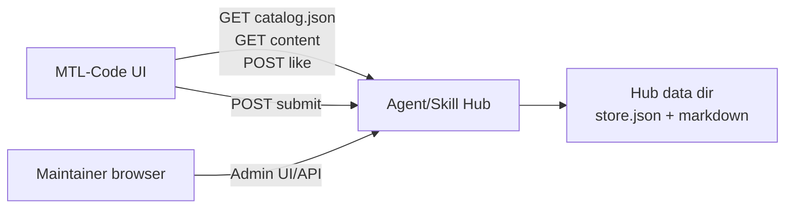

# Agent/Skill Hub Architecture

## Context

Agent/Skill Hub is a standalone repository service. MTL-Code UI and other clients consume its public catalog over HTTP(S), while maintainers use the Hub admin UI or admin API to review and publish Agent templates and Skills.

## Containers

- `src/server.js`: Express app, public repository API, admin API, markdown content storage, and package-style Skill file storage.
- `public/`: static admin UI for status, direct publish, Skill package folder upload, submission review, and deletion.
- `store.json`: catalog metadata, submission metadata, like counters.
- `content/published`: published Agent template and Skill markdown.
- `content/submissions`: pending submission markdown.
- `dist/agent-skill-hub.exe`: optional portable Windows executable built by `npm run package:win`.

## Interfaces

Public repository API:

- `GET /agent-repository/catalog.json`
- `GET /agent-repository/content/:itemId.md`
- `GET /agent-repository/content/:itemId/:packageFile`
- `POST /agent-repository/items/:itemId/like`
- `POST /agent-repository/submit`

Admin API:

- `GET /api/admin/status`
- `GET /api/admin/catalog`
- `GET /api/admin/submissions?status=all`
- `POST /api/admin/submissions/:submissionId/publish`
- `POST /api/admin/submissions/:submissionId/reject`
- `GET /api/admin/items`
- `POST /api/admin/items`
- `PATCH /api/admin/items/:itemId`
- `DELETE /api/admin/items/:itemId`

Compatibility alias:

- `/api/agent-repository-server/*` maps to the same admin router for migration tooling.

## Data Ownership

The Hub owns shared repository data. MTL-Code UI owns local installation, local Agent runtime config, and local Skill files. A client should not mutate Hub storage directly; it should submit content or use authenticated admin APIs.

Published Skill packages are represented in catalog items with `packageFiles`, where each entry has a package-relative `path` and a public `contentUrl`. `SKILL.md` remains the compatibility `contentUrl`, while clients that understand packages fetch every listed file and install the full directory.

## Risks

- File-backed storage is simple and easy to deploy, but it is not a multi-writer database. Use one Hub process per data directory.
- Likes are counted by a lightweight client fingerprint. This is adequate for product feedback, not abuse-resistant ranking.
- Admin APIs must use `HUB_ADMIN_TOKEN` before exposing the service beyond localhost.
- The default bind address is `0.0.0.0`; Windows Firewall or host network policy still controls whether LAN clients can reach the port.

## Deferred

- Database storage.
- OAuth/user accounts.
- Rich moderation workflow.
- Webhook/channel execution.
- Full-text search and ranking service.
