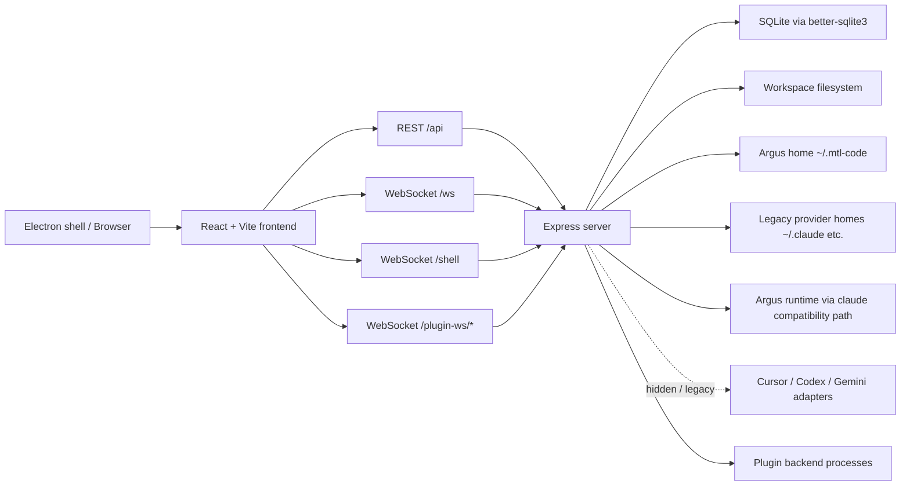

# K2 系统架构

## 运行拓扑

运行时主线是 Argus。`claude` 仍是内部 compatibility provider key，用来承载既有 command、session、MCP、permission 和 message contracts；Cursor、Codex、Gemini adapter 只作为 legacy/hidden 代码存在，不参与 first-use UI。

## 技术栈快照

| 区域 | 技术 |
| --- | --- |
| Frontend | React 18、React Router、Vite、Tailwind、CodeMirror、xterm.js |
| Backend | Node ESM、Express、`ws`、`node-pty`、`better-sqlite3`、`chokidar` |
| Build | Vite client build，加 `server/tsconfig.json` 的 TypeScript server build |
| Auth | local-first user、JWT/API key compatibility、platform mode 特殊路径；显式登录 UI 不属于 first-use 主路径 |
| Realtime | `/ws` 处理聊天/项目事件，`/shell` 处理 PTY，`/plugin-ws/*` 代理插件 |
| Storage | App SQLite 表，加 Argus 原生 session/config 目录；legacy provider 目录只在 fallback 或隐藏 adapter 中使用 |

## 前端形状

`src/main.jsx` 注册 service worker 并挂载 `src/App.tsx`。`App.tsx` 按下面顺序组合全局 Provider：

1. i18n
2. theme
3. auth
4. WebSocket
5. plugins
6. optional task settings / legacy TaskMaster context
7. protected routes

主屏入口是 `src/components/app/AppContent.tsx`。它协调 project/session 状态、响应式 sidebar、WebSocket 恢复逻辑，并把选中状态传给 `src/components/main-content/view/MainContent.tsx`。

前端功能目录通常按这个结构组织：

- `constants/`
- `hooks/`
- `types/`
- `utils/`
- `view/`

HTTP 调用默认走 `src/utils/api.js`。只有当功能已经有清晰的数据模块时，才在局部封装。`src/contexts/*` 只放真正跨 App 的状态。

## 后端形状

`server/index.js` 是当前后端组合根。它负责：

- 加载环境变量并解析 app root
- 创建 Express 和 HTTP server
- 创建共享 WebSocket server
- 注册 auth、routes、静态资源和 fallback serving
- 处理 project discovery、文件操作、Shell PTY、聊天 WebSocket 派发，以及若干历史 REST endpoint

较新的模块化后端代码在 `server/modules`。其中 Provider 模块是当前最清晰的契约，但产品默认只暴露 Argus：

- `server/shared/interfaces.ts` 定义 `IProvider`、`IProviderAuth`、`IProviderMcp`、`IProviderSessions`
- `server/shared/types.ts` 定义 `LLMProvider`、`NormalizedMessage`、MCP 类型和响应形状；`LLMProvider` 仍包含 legacy provider 值以保持兼容
- `server/modules/providers/provider.registry.ts` 解析具体 Provider
- `server/modules/providers/provider.routes.ts` 暴露 Provider auth 和 MCP routes
- `server/modules/providers/list/*` 存放 Provider 专属实现

Argus 使用 `server/modules/providers/list/claude` 和 `server/claude-sdk.js` 的 compatibility path。文件名里的 `claude` 是历史契约，不代表 UI 要显示 Claude Code，也不代表聊天应调用 Anthropic Agent SDK。

## 依赖边界

- 前端 alias `@/*` 指向 `src/*`。
- 后端 alias `@/*` 通过 `server/tsconfig.json` 指向 `server/*`。
- 根目录 `shared/` 是前后端共同可用的 JS，例如 model constants 和 network host helpers。
- `server/shared/` 是后端契约区，不是前端 import 面。
- 前端通过 REST 和 WebSocket 与后端通信，不直接 import `server/`。
- 后端模块需要跨模块依赖时，应暴露公开入口，避免深入另一个模块内部。

## 存储归属

| 存储 | Owner | 说明 |
| --- | --- | --- |
| SQLite app DB | `server/database` | 用户、API key、凭据、通知偏好、VAPID key、自定义会话名、app config。 |
| Argus session files | Argus compatibility provider | `~/.mtl-code/projects` 是主来源；`~/.claude/projects` 只作为 legacy fallback。 |
| Legacy provider session files | Hidden provider adapters | Cursor/Codex/Gemini 原生目录可能仍被 adapter 认识，但 first-use sidebar、search 和 route sync 不应显示它们。 |
| Workspace filesystem | Workspace tools | 文件树、编辑器、上传、Shell，以及隐藏/legacy Git route 操作选中项目路径。 |
| Browser local/session storage | Frontend preferences | active tab、Argus compatibility provider selection、UI preferences；stale provider/model 值需要归一化回 Argus。 |
| Plugin folders/processes | Plugin system | Plugin manifest、assets、可选 backend server。 |

## 架构方向

代码库正在从历史多 Provider 架构收口为 Argus。`server/index.js` 仍然承载很多热路径，Provider 模块保留历史契约以降低迁移风险。

新开发默认遵守：

1. 用户可见主路径只展示 Argus。
2. 内部可以继续使用 `claude` compatibility key，直到 WebSocket、session、MCP、permission、history 和 DB 契约一起迁移。
3. Cursor/Codex/Gemini/Git/TaskMaster/Auth/About/community 等旧 surface 视为 legacy hidden，除非产品明确重新启用。
4. 新的大后端能力优先参考 `server/modules/providers` 的模块化方式；小的历史 endpoint 修改保持局部、控制影响面。
