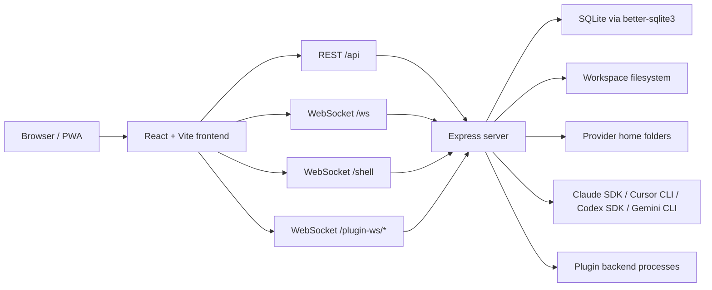

# K2 系统架构

## 运行拓扑

## 技术栈快照

| 区域 | 技术 |
| --- | --- |
| Frontend | React 18、React Router、Vite、Tailwind、CodeMirror、xterm.js |
| Backend | Node ESM、Express、`ws`、`node-pty`、`better-sqlite3`、`chokidar` |
| Build | Vite client build，加 `server/tsconfig.json` 的 TypeScript server build |
| Auth | 本地用户名/密码、JWT bearer token、API key、platform mode 特殊路径 |
| Realtime | `/ws` 处理聊天/项目事件，`/shell` 处理 PTY，`/plugin-ws/*` 代理插件 |
| Storage | App SQLite 表，加 Provider 原生 session/config 目录 |

## 前端形状

`src/main.jsx` 注册 service worker 并挂载 `src/App.tsx`。`App.tsx` 按下面顺序组合全局 Provider：

1. i18n
2. theme
3. auth
4. WebSocket
5. plugins
6. task settings 和 TaskMaster
7. protected routes

主屏入口是 `src/components/app/AppContent.tsx`。它协调 project/session 状态、响应式 sidebar、WebSocket 恢复逻辑，并把选中状态传给 `src/components/main-content/view/MainContent.tsx`。

前端功能目录通常按这个结构组织：

- `constants/`
- `hooks/`
- `types/`
- `utils/`
- `view/`

HTTP 调用默认走 `src/utils/api.js`。只有当功能已经有清晰的数据模块时，才在局部封装。`src/contexts/*` 只放真正跨 App 的状态。

## 后端形状

`server/index.js` 是当前后端组合根。它负责：

- 加载环境变量并解析 app root
- 创建 Express 和 HTTP server
- 创建共享 WebSocket server
- 注册 auth、routes、静态资源和 fallback serving
- 处理 project discovery、文件操作、Shell PTY、聊天 WebSocket 派发，以及若干历史 REST endpoint

较新的模块化后端代码在 `server/modules`。其中 Provider 模块是当前最清晰的契约：

- `server/shared/interfaces.ts` 定义 `IProvider`、`IProviderAuth`、`IProviderMcp`、`IProviderSessions`
- `server/shared/types.ts` 定义 `LLMProvider`、`NormalizedMessage`、MCP 类型和响应形状
- `server/modules/providers/provider.registry.ts` 解析具体 Provider
- `server/modules/providers/provider.routes.ts` 暴露 Provider auth 和 MCP routes
- `server/modules/providers/list/*` 存放 Provider 专属实现

## 依赖边界

- 前端 alias `@/*` 指向 `src/*`。
- 后端 alias `@/*` 通过 `server/tsconfig.json` 指向 `server/*`。
- 根目录 `shared/` 是前后端共同可用的 JS，例如 model constants 和 network host helpers。
- `server/shared/` 是后端契约区，不是前端 import 面。
- 前端通过 REST 和 WebSocket 与后端通信，不直接 import `server/`。
- 后端模块需要跨模块依赖时，应暴露公开入口，避免深入另一个模块内部。

## 存储归属

| 存储 | Owner | 说明 |
| --- | --- | --- |
| SQLite app DB | `server/database` | 用户、API key、凭据、通知偏好、VAPID key、自定义会话名、app config。 |
| Provider session files | Provider integrations | Claude/Cursor/Codex/Gemini 在各自原生位置保存会话历史。 |
| Workspace filesystem | Workspace tools | 文件树、编辑器、上传、Shell、Git 操作选中项目路径。 |
| Browser local/session storage | Frontend preferences | active tab、provider selection、OSS auth token、UI preferences。 |
| Plugin folders/processes | Plugin system | Plugin manifest、assets、可选 backend server。 |

## 架构方向

代码库正在迁移中：`server/index.js` 仍然承载很多热路径，Provider 已开始走明确模块契约。新的较大后端能力优先参考 `server/modules/providers` 的模块化方式；小的历史 endpoint 修改则保持局部、控制影响面。
