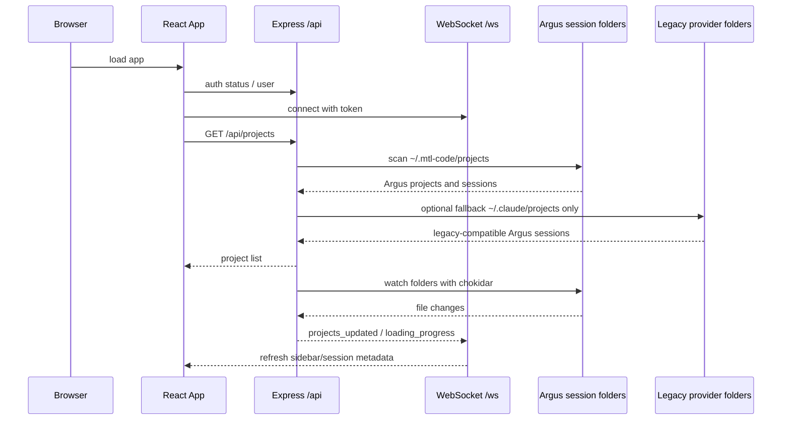
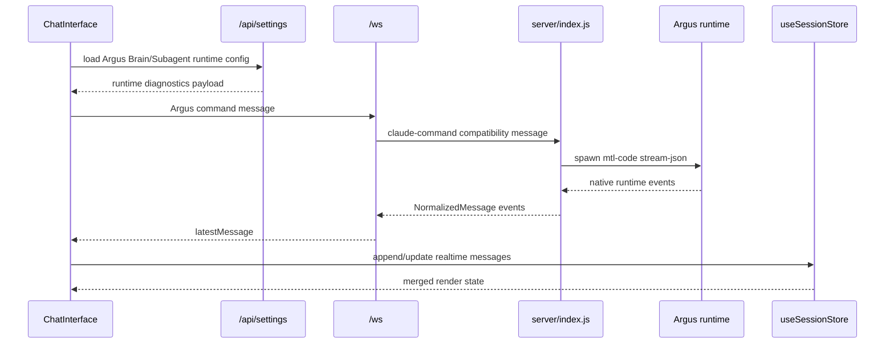
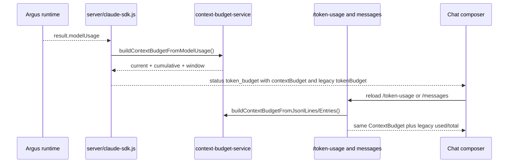
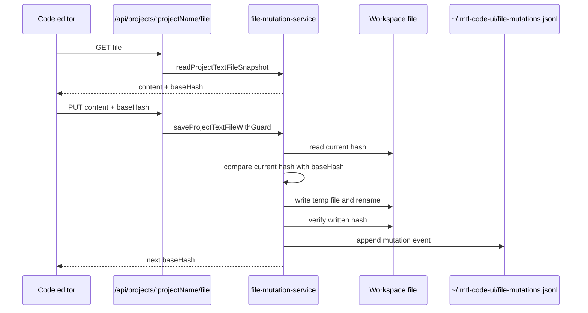
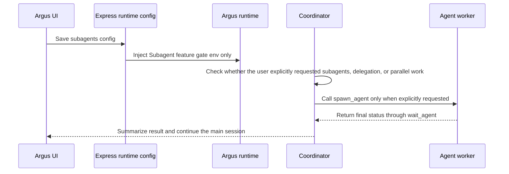

# K4 运行时流程

## App 启动与 Project 同步

First-use invariant: sidebar/project/conversation UI consumes only Argus sessions. `codexSessions`、`cursorSessions`、`geminiSessions` may still appear in legacy data contracts, but they must not be merged into visible conversation lists, search results, or route-sync selection.

Desktop sidebar invariant: top-level actions are quick conversation, search, and the project/conversation switch. Plugins, automations, and the separate Agent config dashboard are not first-use sidebar actions. Project rows stay compact and session rows are clickable across the full row; the `...` affordance owns secondary actions such as rename, pin, archive, dispatch, copy, and delete.

Project creation invariant: packaged desktop builds must open the native Windows folder picker through the Electron `argusDesktop.selectProjectRoot` bridge. The React `FolderBrowserModal` remains only as a web/non-Electron fallback, while runtime paths such as `resources/mtl-code` and `~/.mtl-code` stay unchanged for compatibility.

关键文件：

- `src/components/app/AppContent.tsx`
- `src/hooks/useProjectsState.ts`
- `src/contexts/WebSocketContext.tsx`
- `server/index.js`
- `server/projects.js`

## 打开 Session

1. 用户在 sidebar 选择 session。
2. `useProjectsState` 保存 `selectedProject` 和 `selectedSession`，并跳转到 `/session/:sessionId`。
3. `MainContent` 在 `chat` tab 渲染 `ChatInterface`。
4. `useSessionStore` 从 `/api/sessions/:sessionId/messages` 拉取持久化消息。
5. `server/routes/messages.js` 调用 Argus/`claude` compatibility session adapter。
6. Argus 历史被转换为 `NormalizedMessage[]`。
7. 前端合并 server messages 和 realtime messages 后渲染。

关键不变量：server history 是稳定来源，realtime messages 是飞行中的覆盖层。

会话路由和面板切换不变量：

1. 点击侧边栏会话或直接打开 `/session/:id` 时，项目、会话和 URL 必须先对齐，并进入 Chat。
2. 当当前 URL 已经指向同一个 session 时，顶部 Chat / Files / Shell / Changes / Run / Preview / Results 面板切换不能再次被路由同步逻辑重置回 Chat。

滚动稳定性不变量：

1. 后台 `projects_updated`、WebSocket reconnect 或 agent/subagent 历史合并触发消息刷新时，只刷新当前可见窗口；除非用户主动加载全部历史，不要把完整 JSONL 历史一次性替换进 DOM。
2. 同一 session 的历史刷新必须捕获当前可见消息锚点并恢复滚动位置；如果用户本来在底部，则刷新后回到底部。
3. 程序化刷新和锚点恢复期间必须临时屏蔽“滚到顶部自动加载更早消息”，避免消息高度重算把对话区误判为用户滚到顶部。

## 发送 Agent 消息

Argus Brain / Subagent current runtime

1. Settings reads `argusBrain` and `subagents` from `~/.mtl-code/settings.json`. Legacy `openMythosRuntime` is ignored.
2. Agent Profile runtime settings, uploaded files, MCP/Skill bindings, and Brain recall are applied before the provider command is dispatched.
3. Brain captures command, runtime event, checkpoint, artifact, assistant summary, error, and permission events without blocking chat.
4. Brain compacts long task state into a Mermaid canvas with refs; Subagent execution remains controlled only by `subagents.enabled`.
5. `agent_runtime_debug` exposes Brain diagnostics, runtime timeline data, token use, permission blocks, and Subagent gates; it no longer exposes an OpenMythos card.

`server/index.js` 当前主路径处理 `claude-command`，它是 Argus 的 compatibility message type。以下其他 command types 可能仍在旧代码中存在，但属于 legacy hidden Provider surface：

- `cursor-command`
- `codex-command`
- `gemini-command`

Argus 主路径还会使用：

- `claude-command`
- `abort-session`
- `check-session-status`
- `get-pending-permissions`
- `get-active-sessions`
- `claude-permission-response`

## ContextBudget / 上下文显示流程

UI 的上下文数字统一使用 `ContextBudget`，不要再让实时、REST、历史加载各算一套。

关键口径：

1. `current.used` 表示当前请求占用的上下文窗口，按 `input + cacheRead + cacheCreation` 计算，不包含 `output`。
2. `cumulative.used` 表示当前会话累计 token 流量，包含 `input + output + cacheRead + cacheCreation`。
3. `window.tokens` 的优先级是 Argus `modelUsage.contextWindow`、会话绑定模型 profile、当前 active profile、环境变量、`200000` fallback。
4. DeepSeek V4 profile（`deepseek-v4-pro`、`deepseek-v4-flash`）必须显示 1M 窗口；如果显示 200K，优先检查 profile 绑定和 `ContextBudget.window.source`。
5. `tokenBudget`、`tokenUsage.used`、`tokenUsage.total` 仍保留为旧 UI/命令兼容字段，但新 UI 必须从 `contextBudget.current` 和 `contextBudget.cumulative` 读取。

New-session UI invariant:

1. `useChatComposerState` creates a `new-session-*` display session before the backend has a real CLI session id.
2. The temporary id is only for frontend rendering; provider command payloads must not pass it as `options.sessionId` or `resume`.
3. `useChatRealtimeHandlers` routes early errors/stream events to the temporary id via `pendingViewSessionRef`.
4. When `session_created` arrives, `useSessionStore.replaceSessionId()` moves buffered messages from the temporary id to the real session id.
5. This keeps the first user message visible even when the backend is still starting or fails before emitting a native session id.

## Tool Permission 流程

1. Argus runtime 通过 `claude-command` compatibility path 发出 permission request。
2. 后端通过 `/ws` 发送 normalized permission event。
3. Chat UI 渲染 permission request。
4. 用户允许或拒绝。
5. UI 携带 `requestId` 发送 `claude-permission-response`。这里的 message type 是兼容名称，不是用户可见品牌。
6. `server/claude-sdk.js` 解析 pending approval，然后继续或阻止工具调用。

除非产品明确要求“记住权限”，一次性 approval 不应被持久化。

Argus first-use 默认权限为 `acceptEdits`：新会话会自动允许 `Edit`、`Write`、`MultiEdit`、`NotebookEdit` 这类文件编辑工具，Shell/Bash 仍按规则申请或走 Runtime Permissions。历史 `localStorage` 或旧设置里如果保存了整类 `Bash`、`Edit`、`Write` deny，前端 `chatStorage` 和后端 `claude-sdk.js` 会清理这些 stale deny，避免 Task/Agent worker 被派发后无法落盘。`Task`/`Agent` 本身只负责派发 worker，真正写入仍由 worker 内部调用文件编辑工具完成。

## 运行诊断流程

1. 每次发送 Argus 消息前，`server/index.js` 会根据最终 command options 生成 `runtimeDiagnostics`。
2. 后端通过 WebSocket 发送 `kind=status`、`text=agent_runtime_debug` 的 normalized message。
3. `useChatRealtimeHandlers` 接收后给诊断补上当前可见 session id，并写入 ChatInterface。
4. `ChatInterface` 通过模块级 session 缓存保存最近一次诊断；切换到别的会话再回来时必须恢复原 session 的诊断，不依赖组件内部 ref。
5. `AgentRuntimeDiagnosticsPanel` 只展示最近一次后端实际收到的配置，不从前端预估配置生成。
6. 新会话从临时 id 替换成真实 id 时，需要把诊断迁移到真实 session id，避免首轮诊断在刷新项目/会话后消失。

## Workspace 文件流程

1. File tree 请求 `/api/projects/:projectName/files`。
2. 读取/编辑使用 `/api/projects/:projectName/file` 或 `/files/content`。
3. create/rename/delete/upload endpoint 会把目标路径校验在选中 project root 内。
4. Code editor 更新打开文档，并通过 `src/utils/api.js` 保存。

安全规则：所有文件操作都必须在读写前 resolve 并 validate path。

## Git 流程

Review is the first visible Git-backed surface in the current first-use product. It exposes local change review, file diffs, stage, unstage, and discard. Broader Git settings, Git-first project creation, branch management, history, and remotes remain compatibility/future surfaces.

1. `ReviewPanel` calls `/api/git/status` and `/api/git/diff` for project-scoped local changes.
2. Review file actions call `/api/git/stage`, `/api/git/unstage`, and `/api/git/discard`.
3. `server/routes/git.js` resolves the project into the actual repository root before executing Git commands.
4. The broader legacy `GitPanel` can still call branch, commit, history, and remote endpoints, but it is not shown in first-use navigation.

Git 改动影响 workspace，不影响 Argus 原生 session history。

## 写入守卫流程

文件编辑器和文件树写入必须优先走 `server/services/file-mutation-service.js`，不要在路由里直接散落 `writeFile`。Argus CLI 的 `FileWriteTool` / `FileEditTool` 继续走 `../claude-code/src/utils/file.ts` 的 `writeTextContent`，该底层写入需要保持临时文件替换和写后内容校验。

关键不变量：

1. 保存文本文件时，前端必须回传最近一次读取到的 `baseHash`。
2. 如果磁盘上的当前 hash 和 `baseHash` 不一致，后端返回 `409 FILE_WRITE_CONFLICT`，前端提示用户重新加载，不能覆盖。
3. 写入必须使用同目录临时文件加 `rename`，写完后重新读取校验 hash。
4. 同一进程内同一文件写入要串行化，避免两个保存请求同时读取同一个旧 hash 后互相覆盖。
  5. 写入、创建、重命名、删除和上传都要记录到 `file-mutations.jsonl`，方便回溯“谁在什么时候动了什么”。
  6. Argus CLI 工具写入完成后必须重新读取目标文件并比对内容，避免 Windows/同步盘/杀软干扰下出现“工具返回成功但磁盘内容不一致”。

## Shell 流程

1. Shell UI 打开 `/shell` WebSocket。
2. UI 发送 `init`，包含 project path、session id、provider 和可选 initial command。
3. 后端按 project/session/command 生成 key，创建或复用 PTY session。
4. PTY output 流式返回给 xterm。
5. login/auth command 会使用新 PTY session，不复用缓存 session。

关键文件：

- `src/components/shell`
- `src/components/standalone-shell`
- `server/index.js` 的 `handleShellConnection`

## MCP 管理流程

1. MCP UI 调用 `/api/providers/:provider/mcp/servers`。
2. `provider.routes.ts` 解析 provider、scope、transport payload。
3. `providerMcpService` 通过 registry 找到 Provider。
4. Provider-specific MCP adapter 读写原生 Provider config。
5. UI 按 scope 刷新 grouped server list。

Global add 走 `/api/providers/mcp/servers/global`，但 first-use 产品默认只应影响 Argus/`claude` compatibility provider。不要因为 legacy adapters 存在就把 MCP UI 扩展为多 Provider 选择器。

Agent Builder 的“浏览应用 > 自定义 MCP”复用同一套 Provider MCP API：

1. 弹窗读取 `GET /api/providers/claude/mcp/servers?scope=user`，并在存在项目路径时追加读取 `scope=project&workspacePath=<path>`。
2. 新增或更新 MCP Server 调用 `POST /api/providers/claude/mcp/servers`，支持 `stdio`、`http`、`sse`。
3. `scope=user` 写入用户全局 Provider MCP config；`scope=project` 写入对应 workspace 的项目 MCP config。
4. 保存成功后，Agent config 增加 `appBindings` 项，格式为 `MCP: <serverName>`，槽位为 `高级工具` 或 `高级工具 / <projectName>`。
5. 当前绑定用于 Agent prompt 和配置可视化；实际 MCP 可用性来自 Provider 原生 MCP config，不是前端 mock。

Implemented app catalog invariant:

1. Agent Builder should only list app integrations that have a working runtime path.
2. Current app catalog lists `自定义 MCP` only.
3. Google, Slack, Notion, GitHub, Teams, SharePoint, Outlook, and demo apps stay hidden until their connector/runtime support is implemented.

MCP closure updates:

1. Agent Builder can inspect a configured MCP server with `GET /api/providers/:provider/mcp/servers/:name/inspect?scope=user|project&workspacePath=...`.
2. Stdio inspection checks whether the command is discoverable as an absolute path, relative path, or PATH executable. HTTP/SSE inspection performs a lightweight connectivity request with a short timeout.
3. The inspect endpoint intentionally reports provider-level availability only. Tool enumeration still belongs to the native provider runtime after the MCP server is started.
4. Agent Builder can unbind an MCP entry from the Agent without deleting the provider config, or delete the provider MCP server with `DELETE /api/providers/:provider/mcp/servers/:name`.
5. The MCP app binding remains a reference (`MCP: <serverName>`). Runtime execution is still provided by the provider's native MCP config.

MCP diagnostics updates:

1. Repository MCP cards can call `GET /api/providers/:provider/mcp/servers/:name/diagnose?scope=user|project&workspacePath=...`.
2. Diagnostics checks whether the package directory exists, npm dependencies are present, provider config was written, required setup fields are configured, and the stdio command can launch.
3. Password/token fields are reported only as `configured` or `missing`; secret values are never returned.
4. Manifest-declared tools are shown as a hint, but live tool discovery still belongs to the Argus runtime after the conversation starts.

## Plugin 流程

1. `PluginsProvider` 加载 `/api/plugins`。
2. Plugin route 读取 manifests 和 enabled state。
3. 启用插件可能通过 `plugin-process-manager` 启动后端服务。
4. Plugin tab 通过 `PluginTabContent` 渲染。
5. Plugin WebSocket 可通过 `/plugin-ws/*` 代理。

插件错误应该显示在插件设置中，不应拖垮核心 app shell。

## Agent Template / Skill Repository Flow

1. Settings > Agents > Repository loads `GET /api/agent-repository/catalog`.
2. `server/routes/agent-repository.js` merges the local writable repository with enabled external HTTP(S) catalogs.
3. Upload writes agent templates, `SKILL.md` content, or complete Skill package folders into `~/.mtl-code-ui/agent-repository/local` and updates the local `catalog.json`.
4. Install pulls item content and writes agent templates to `~/.mtl-code/agents/<name>.md` or project `.claude/agents/<name>.md`; skills go to `~/.mtl-code/skills/<name>/` or project `.claude/skills/<name>/`, preserving package files when the catalog provides `packageFiles`.
5. Likes are stored in the local repository catalog for local items. Remote items can provide `likeUrl`; otherwise the UI backend stores a local like overlay.
6. Agent templates can include `supportedApps`, `appSlots`, and `capabilities`; the Repository UI renders these as a template gallery and setup dialog before installing.
7. Setup selections are sent as `configuration.appBindings`; the backend appends them to the installed Agent markdown as prompt-visible application context.
8. Installing an Agent template through the guided setup also creates or updates a runtime Agent config through `POST /api/agents`, using the installed markdown as the Agent system prompt.
9. Skills install as single files or full package directories. They are not auto-bound to an Agent until the user selects or references them in Agent configuration.
10. Agent Builder loads real installed Skills through `GET /api/agents/skills/installed`, scanning user and project skill roots for `SKILL.md`.
11. Skill discovery roots prefer `~/.mtl-code/skills` and project-local `.mtl-code/skills`. `.claude/skills` is a legacy compatibility fallback; `.codex/skills` and other legacy roots should not become visible first-use concepts unless multi-provider support is explicitly restored.
12. Bound Agent skills are marked as callable only when the Skill registry can find a matching installed package. Missing skills remain visible but show as not installed.

## Remote Agent Repository Server Flow

1. Remote repository serving is no longer embedded in Argus. It lives in the standalone `agent-skill-hub` project.
2. Argus acts as a client: users add `https://host/agent-repository/catalog.json` as a Repository source.
3. Public submissions call the Hub's `POST /agent-repository/submit` endpoint and are stored under the Hub data directory.
4. Admin review APIs live on the Hub under `/api/admin/*`; Argus no longer mounts `/api/agent-repository-server`.
5. Published items appear in `GET /agent-repository/catalog.json` with relative `contentUrl` and `likeUrl` values.
6. Remote likes call `POST /agent-repository/items/:itemId/like`, update global counters, and are reflected in the next catalog sync.
7. Published Agent templates preserve ChatGPT-style metadata (`icon`, `supportedApps`, `appSlots`, `capabilities`) so downstream clients can render a guided creation flow.
8. Settings > Agents > Repository shows the standalone Hub catalog URL convention and keeps catalog consumption/install flows.
9. Hub administration is done in the standalone Hub web UI, not inside the desktop UI.

## Agent Runtime Invocation Flow

Agent Profile mode:

1. `ChatComposer` exposes six lightweight built-in modes: `Plan`, `Build`, `Explore`, `Review`, `Debug`, and `Docs`.
2. The selected mode is sent as `options.agentProfileKind`; a leading `@plan`, `@build`, `@explore`, `@review`, `@debug`, or `@docs` overrides it for one message and is stripped before normal Agent mention parsing.
3. `server/services/agent-profile-runtime-service.js` resolves the profile before `applyAgentRuntimeToChatCommand()`, applies the profile permission preset, merges default profile Skills, and appends the profile prompt through the existing `appendSystemPrompt` path.
4. Profiles are collaboration modes, not full reusable Agent configs. Full Agents still use `options.agentId`; Profiles only narrow model behavior, permission posture, optional Skill/MCP hints, and diagnostics.
5. `Plan` and `Explore` use plan permission posture, so they do not auto-edit. `Build`, `Debug`, and `Docs` use `acceptEdits`; `Review` stays read-only-first through prompt guidance and default permissions.

1. Agent runtime configs are persisted by `server/services/agent-config-service.js` in `~/.mtl-code-ui/agents/agents.json`.
2. The main Agent config page is a template/config management surface, not a workspace-start screen. It loads and edits configs through authenticated `/api/agents` endpoints, including model, context window, prompt, skills, tools, app bindings, guardrails, and trigger keywords.
3. Project chat never loads or displays Agent selection. It sends commands with `allowSessionAgentBinding: false`, so project sessions use the default Argus runtime even if a stale binding row exists.
4. Standalone conversation chat loads enabled agents and binds selection to a single conversation, not to the workspace. Persisted conversation bindings use authenticated backend APIs:
   - `GET /api/sessions/:sessionId/agent?provider=claude`
   - `PUT /api/sessions/:sessionId/agent`
   - `DELETE /api/sessions/:sessionId/agent?provider=claude`
5. New standalone conversations show a yes/no choice for whether to use an Agent. Choosing no keeps the default Argus conversation. Choosing yes asks for the Agent and, if needed, slot setup.
6. If the selected Agent declares application slots, the composer opens a setup dialog and requires slot-to-app selections before binding the Agent to the conversation.
7. Per-conversation Agent slot selections are stored as `session_agent_bindings.config_json`. New installs create the column with the table; existing installs add it during DB migration.
8. A leading `@agent` mention can match `id`, `name`, or `shortName` and overrides the conversation Agent for that one message only.
9. Frontend sends the resolved agent as `options.agentId`, resolved slot config as `options.agentAppBindings`, and the guard flag `options.allowSessionAgentBinding` in the existing WebSocket command payload. This keeps the provider command shape stable while making slots backend-visible.
10. `server/index.js` resolves the agent at send time. If a concrete session ID is available and the frontend did not send `options.agentId`, the backend falls back to the persisted session binding only when `allowSessionAgentBinding === true`. If fresh `options.agentAppBindings` are not sent, it falls back to the persisted `config_json`. Disabled, draft, or missing agents are ignored.
11. `server/services/agent-config-service.js` applies session slot configuration before building the Agent prompt, so the prompt reflects the per-conversation app choices rather than only the reusable Agent template defaults.
12. Agent knowledge/RAG is removed from the product runtime. Do not add upload, indexing, retrieval, or RAG prompt injection surfaces unless the product direction changes again.
13. Agent skills are resolved through `server/services/agent-skill-service.js` at runtime. Installed skills include provider/scope/path details in the Agent prompt; missing skills are explicitly marked as unavailable.
14. For Argus (`claude-command` compatibility path), the backend passes the agent profile through `--append-system-prompt`, preserving the default coding/safety prompt while adding the selected Agent role, skills, application bindings, memory metadata, and guardrails.
15. Agent `modelConfig.contextWindowTokens` is forwarded as `options.contextWindowTokens`; `server/claude-sdk.js` writes it into `MTL_CODE_MAX_CONTEXT_TOKENS` and `CONTEXT_WINDOW` for the spawned Argus child. This is a real backend runtime override, not a GUI-only value.
16. Agent `modelConfig.model` overrides the Argus model only when it is not `inherit`. Legacy providers are hidden in first-use UI and should not drive visible model behavior.
17. Agent MCP app bindings do not create a separate runtime transport. They reference MCP servers already persisted through Provider MCP config, so the spawned Argus provider discovers them through its native config files.

Agent quick start:

1. Sidebar conversation mode uses the normal new-conversation button. There is no separate quick Agent selector in the sidebar.
2. Creating a new standalone conversation clears the selected project session and opens a blank chat.
3. The blank chat asks whether to use an Agent. If yes, the user selects the Agent and completes required slot setup before the Agent is considered active.
4. The empty conversation surface shows the selected Agent only after setup is complete.
5. The first sent Agent-backed message includes `options.agentId`, `options.agentAppBindings`, and `allowSessionAgentBinding: true`; after the real session ID is created, the session-agent binding flow persists both values for later reloads.

Project/conversation separation:

1. Project sessions and standalone conversations are independent sidebar modes.
2. `useProjectsState` clears `selectedConversationSession` when project mode or a project session is selected.
3. Both modes display Argus sessions only. Legacy provider sessions must remain hidden even if backend payloads still carry `cursorSessions`、`codexSessions` or `geminiSessions`.

2026-04-28 implementation note:

1. Project chat uses the default Argus runtime path. It does not load Agent lists or render Agent selectors in the composer. It can still show installed Skills; when a project session selects Skills, the UI persists an empty-Agent session binding with `configuration.skills` so later messages in that same session keep the Skill context.
2. Standalone conversation chat owns Agent and Skill binding. It loads enabled Agents, installed Skills, persisted session binding, and sends `allowSessionAgentBinding: true`.
3. Agent setup dialogs resolve MCP slots from real provider MCP configuration by reading user-scoped MCP servers and, when a workspace path is available, project-scoped MCP servers.
4. Placeholder app values such as `Custom MCP` or `自定义 MCP` are not valid final slot selections. A user must choose a concrete `MCP: <serverName>` entry before enabling the Agent for the conversation.
5. The composer shows a runtime binding strip for standalone conversations. It lists the active Agent, selected `MCP: <serverName>` bindings, and selected Skills with callable/missing status.
6. The composer shows selected Skills in project sessions too, but never exposes an Agent selector there.
7. The backend emits `agent_runtime_debug` status events and console logs whenever an Agent or session Skill prompt is applied. The payload includes Agent identity, app/MCP bindings, session/effective Skills, prompt length, model, context window, project path, session id, and the permission snapshot.
8. The chat UI intentionally keeps `agent_runtime_debug` out of the message list and visible run status. It is exposed only through the composer diagnostics panel.
9. Switching to conversation mode clears `selectedSession` so project-backed sessions do not remain active behind the standalone conversation list.
10. Switching between project and conversation modes navigates back to `/` and ignores the previous `/session/:id` route once, preventing the route synchronization effect from immediately pulling the UI back into the old project session.
11. `MainContent` keys `ChatInterface` by mode, project, and session ID so stale local state does not leak when switching modes.

## Historical Subagent Strategy Notes

OpenMythos is removed from the active runtime. Subagent execution remains a separate feature gate controlled by `subagents.enabled`.

Invariants:

1. Brain recall is not a subagent dispatcher.
2. Subagent tools are exposed only when the Subagents setting enables them for a new session.
3. Runtime diagnostics show Brain state and Subagent gates; they do not show an OpenMythos card.
4. Internal subagent notifications stay grouped under their parent container instead of becoming normal chat bubbles.

## Worktree Dispatch Management

1. Users create managed worktrees from a project session item. The project only resolves the Git root and base ref.
2. The frontend calls `POST /api/projects/:projectName/worktrees` with the source session id and provider.
3. Managed worktrees are created with `git worktree add --detach`, registered as separate projects, and bound to the derived session.
4. Parent projects can list their tasks through `GET /api/projects/:projectName/worktrees`; this is a management list, not the primary creation entry.
5. The Worktree task list shows status, task title, base ref/commit, branch state, session binding, path, and creation time.
6. Users can continue opening a worktree project, enter its bound session, create a branch, or delete/archive a clean managed worktree.
7. Dirty worktrees are protected by the existing backend `git status --porcelain` deletion check.

## Session Management Metadata

1. Session rename still writes to `session_names.custom_name`.
2. `PATCH /api/sessions/:sessionId/metadata` updates lightweight UI metadata such as pinned and archived state.
3. Session lists receive `isPinned`, `pinnedAt`, `isArchived`, and `archivedAt` through `applyCustomSessionNames`.
4. Pinned sessions sort first, archived sessions sort last and remain visible with a dimmed style so recovery stays obvious.

Channel status:

1. The Agent Builder channel cards are currently configuration placeholders only.
2. DingTalk, Slack, webhook, and other external channel runtimes are intentionally deferred until the Agent/MCP/repository loop is stable.

Agent management APIs:

1. `GET /api/agents?includePaused=true|false` lists Agent configs.
2. `GET /api/agents/:agentId` reads one Agent config.
3. `GET /api/agents/skills/installed?workspacePath=...` lists installed Skill packages and their callable status.
4. `POST /api/agents` creates or upserts an Agent.
5. `PUT /api/agents/:agentId` and `PATCH /api/agents/:agentId` update an Agent.
6. `DELETE /api/agents/:agentId` deletes the Agent and clears session bindings for that Agent.

## Argus Anthropic-Compatible Model Config Flow

1. User opens Settings > Agents; the only visible agent is `Argus`, while the internal provider key remains `claude`.
2. The Model tab calls `GET /api/settings/mtl-code-model`.
3. `server/routes/settings.js` reads `~/.mtl-code/settings.json`, with a legacy read-only fallback to `~/.claude/settings.json`.
4. The UI saves changes with `PUT /api/settings/mtl-code-model`.
5. The route writes `modelType: "anthropic"`, `model`, `env.ANTHROPIC_AUTH_TOKEN`, `env.ANTHROPIC_BASE_URL`, `env.ANTHROPIC_MODEL`, and Anthropic default model aliases.
6. The route clears legacy `env.OPENAI_*` keys so new sessions cannot accidentally route through OpenAI Chat Completions.
7. New Argus backend sessions load those settings and use the Anthropic Messages API request format.
8. Auth status reports `method: "anthropic_compatible"` when an Anthropic token is configured for a custom base URL.

Invariant: visible naming is Argus, but backend/session compatibility still uses the `claude` provider key until the full provider ID migration is completed.

New-chat invariant: `ProviderSelectionEmptyState.tsx` is not a provider/model picker. It shows one `Argus` surface, and `useChatProviderState.ts` rewrites stale local storage values back to `selected-provider=claude` and `claude-model=mtlcode`.

DeepSeek Anthropic adapter invariant:

1. DeepSeek custom runtime config uses the Anthropic-compatible endpoint, typically `ANTHROPIC_BASE_URL=https://api.deepseek.com/anthropic`.
2. `server/claude-sdk.js` merges `~/.mtl-code/settings.json.env` into the spawned Argus child process so model/base URL/token/effort settings are active even when the UI server itself was started without those env vars.
3. UI-spawned Argus now exposes `runtime.claudeNativeMemoryEnabled` from `/api/settings/mtl-code-model`, defaulting to `true`. When enabled, `server/claude-sdk.js` forces `MTL_CODE_UI_BARE=0`, does not pass `--bare`, and clears `MTL_CODE_SIMPLE` / `MTL_CODE_DISABLE_AUTO_MEMORY` so Claude native memory, CLAUDE.md discovery, and topic recall can run.
4. `runtime.bareMode` remains the explicit lightweight startup switch. When enabled, `MTL_CODE_UI_BARE=1`, `--bare` is passed, and Claude native memory is unavailable for that session.
5. When the endpoint or model is DeepSeek, the spawn env supplies both `MTL_CODE_EFFORT_LEVEL` and `CLAUDE_CODE_EFFORT_LEVEL` with a default of `high`. Subagents and workflows use their Agent Profile model binding instead of a dedicated secondary runtime env.
6. The Argus backend treats DeepSeek as Anthropic-compatible but suppresses Anthropic `thinking.budget_tokens`; DeepSeek thinking strength is controlled through `output_config.effort`.
7. Context window length is part of the same saved settings flow. The UI writes `runtime.contextWindowTokens`; `server/routes/settings.js` persists it as `MTL_CODE_MAX_CONTEXT_TOKENS` and `CONTEXT_WINDOW`; `server/claude-sdk.js` passes it to the spawned Argus child process. DeepSeek 1M endpoints should be set explicitly to `1000000`; there is no provider-specific automatic context-window override.
8. A high `cache_read_input_tokens` number on a simple prompt is usually the coding-agent prompt/tool/project context being read from provider cache, not the literal user prompt size. `--bare` reduces avoidable auto-context, but agent tool schemas still cost context.

Brain + MCP boundary invariant:

1. Argus Brain is the only built-in project memory surface.
2. External knowledge, code search, impact analysis, and enterprise systems are connected through MCP servers, Skills, and Agent Profiles.
3. Ordinary `remember` / `forget` commands are left for Claude native memory.
4. Brain recall tells the model to verify historical task state against current files, settings, and runtime state before acting on it.

Project session discovery invariant:

1. Provider project folders live under `~/.mtl-code/projects/<encoded-project-name>` with `~/.claude/projects` as a legacy fallback.
2. `findProjectDir()` must return the concrete encoded project directory, not the parent `projects` root.
3. `getSessions()` reads JSONL files from that concrete directory and converts entries with `sessionId` into sidebar sessions.
4. A project showing chat messages in the main panel but `0` sidebar sessions usually means discovery is pointed at the wrong folder level or the native JSONL parser no longer matches the persisted message shape.
5. The first-use sidebar intentionally displays only Argus sessions. The internal compatibility provider is still `claude`, so project and standalone conversation lists consume `project.sessions` and ignore `codexSessions`, `cursorSessions`, and `geminiSessions` in the visible conversation UI.

Context compaction visibility:

1. Argus runtime owns actual context compaction. The UI does not summarize chat history itself.
2. Claude JSONL `system` entries with `subtype=compact_boundary` or `subtype=microcompact_boundary` are normalized as `context_compaction` messages.
3. When a `compact_boundary` is followed by an `isCompactSummary` transcript-only user entry, `ClaudeSessionsProvider.fetchHistory()` attaches that summary to the same normalized compaction event and skips the synthetic user entry.
4. Realtime compaction events can still render without a summary first; if the runtime later streams an orphan compact summary, it renders as a separate summary card rather than a normal user message.
5. The chat message renderer displays a centered compaction boundary card with trigger, pre-compact tokens, saved tokens, affected tool count, and an expandable summary section when available.

## TaskMaster / PRD 流程

1. Task settings 决定 tasks tab 是否可见。
2. `TaskMasterPanel` 绑定当前选中的 project。
3. `server/routes/taskmaster.js` 处理 install/status/tasks/PRD/template 动作。
4. PRD editor 管理 PRD 文档，并可触发 task generation。

TaskMaster 必须保持可选；不可用或关闭时，主 tab 应回到 chat。
