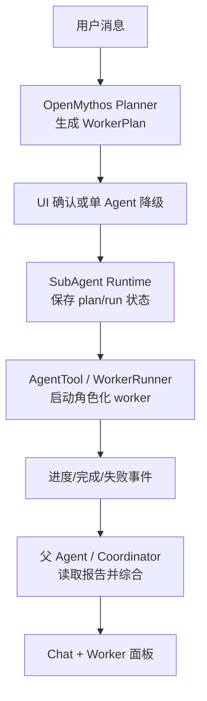

# DeepSeek-TUI 多 Agent 逻辑设计借鉴

日期：2026-05-04

## 目标

当前 Argus/OpenMythos 的多 Agent 设计已切到“策略层生成 WorkerPlan，WorkerRuntime 调用 AgentTool 启动角色化 worker”。目标是补齐计划对象、角色分工、生命周期、结果契约、恢复语义和父 Agent 集成协议。

DeepSeek-TUI 的设计更值得借鉴：它把子 Agent 做成一套明确的运行时能力，而不是只做提示词路由。本文先记录 DeepSeek-TUI 的逻辑结构，再给出 Argus/OpenMythos 的落地改造方向。

## DeepSeek-TUI 的核心逻辑

### 1. 策略和执行分层

DeepSeek-TUI 明确区分：

- 父 Agent：决定是否拆分、何时等待、如何综合结果。
- SubAgentManager：负责创建、登记、限制并发、恢复状态、更新结果。
- SubAgent loop：每个子 Agent 拥有自己的系统提示、消息数组、工具注册表和执行循环。
- TUI/runtime 事件层：把子 Agent 开始、进度、完成、失败、token 使用量映射回父会话和界面。

这意味着“是否需要 worker”不是等同于“直接调用 Agent 工具”。先有可解释的 assignment，再有受控的 spawn，再有可查询的状态和结果。

### 2. 单一工具面

DeepSeek-TUI 删除旧 swarm 面，保留一套模型可见工具：

- `agent_spawn`：启动后台子 Agent，立即返回 `agent_id`。
- `agent_wait`：等待一个或多个子 Agent，支持 `any` / `all`。
- `agent_result`：查询状态或拉取最终结果。
- `agent_cancel` / `agent_close`：取消或关闭。
- `agent_list`：列出当前会话子 Agent，默认过滤历史归档。
- `agent_send_input`：给运行中的子 Agent 追加输入。
- `agent_assign`：更新 objective/role 并可立即投递 coordinator note。
- `agent_resume`：对 interrupted/terminal 记录进行恢复尝试。

关键点是：父 Agent 不必把“派发”和“等待结果”塞在同一次工具调用里。派发后父 Agent 可以继续做不重叠工作，也可以显式等待、拉结果或取消。

### 3. 角色是行为姿态，不只是标签

DeepSeek-TUI 的 `SubAgentType` 包含：

- `general`：通用多步任务。
- `explore`：读多写少，快速定位证据。
- `plan`：分析并产出策略。
- `review`：审查并给风险。
- `implementer`：按明确目标落最小改动。
- `verifier`：跑测试或验证门禁，报告通过/失败。
- `custom`：显式工具白名单。

每个角色都有独立 prompt posture。默认子 Agent 继承完整工具面，但 `custom` 可以用 allowlist 收紧。这样能同时解决两个问题：模型知道“为什么派这个 worker”，运行时也知道“这个 worker 的能力边界是什么”。

### 4. 状态模型完整

子 Agent 记录包含：

- `agent_id`
- `agent_type`
- `assignment.objective`
- `assignment.role`
- `model`
- `nickname`
- `status`
- `result`
- `steps_taken`
- `duration_ms`
- `from_prior_session`

状态流转：

```text
Pending -> Running -> Completed | Failed(reason) | Cancelled | Interrupted(reason)
```

进程重启后，DeepSeek-TUI 会把持久化文件里仍为 `Running` 的记录标记为 `Interrupted`，避免界面和模型误以为后台任务仍在执行。

### 5. 并发、深度和 workspace 边界受控

DeepSeek-TUI 在 spawn 前检查：

- 并发上限，默认 10，硬上限 20。
- 递归深度上限。
- `cwd` 必须在父 workspace 下。
- 子 Agent 使用 child cancellation token，父级取消可以传递给后代。

这比“先生成 N 个 worker 文案，然后全部尝试调用 AgentTool”更稳，因为调度失败可以成为状态，而不是散落在提示词或日志里。

### 6. 完成协议清晰

子 Agent 完成时会同时发：

- 人类可读摘要。
- 结构化哨兵：`<deepseek:subagent.done>{...}</deepseek:subagent.done>`。

父 Agent 的集成协议是：

1. 看到 done sentinel 先读 summary。
2. 不重复做子 Agent 已完成的工作。
3. summary 不够再 `agent_result`。
4. 子 Agent failed 时判断是否阻塞主线。
5. 更新 checklist/plan。

子 Agent 最终输出还必须遵守固定报告结构：

```text
SUMMARY
EVIDENCE
CHANGES
RISKS
BLOCKERS
```

这比普通 `<task-notification>` 更适合做父 Agent 综合，因为它强制 worker 把证据、改动、风险和阻塞分开。

## Argus/OpenMythos 当前状态

### 已有能力

- `claude-code/src/utils/openmythosRuntime.ts` 会根据用户输入推断 effort、risk、phase、expert routes 和 `workerPlan`。
- `claude-code/src/utils/openmythosWorkerRuntime.ts` 会在确认后调用 `AgentTool.call()`，用角色化 worker 类型和 `run_in_background: true` 启动 worker。
- `claude-code/src/coordinator/workerAgent.ts` 定义了 coordinator mode 下的内置 `worker` Agent。
- `claude-code/packages/builtin-tools/src/tools/AgentTool/AgentTool.tsx` 已经有异步 Agent、前后台任务、进度、通知、worktree/cwd、独立 worker tool pool 等基础能力。
- `claudecodeui/server/claude-sdk.js` 会把 UI 的本轮确认结果转成 `MTL_CODE_OPENMYTHOS_AUTO_DISPATCH` / `MTL_CODE_OPENMYTHOS_DISPATCH_CONFIRMED` 环境变量。
- `claudecodeui/server/routes/settings.js` 提供发送前 dispatch preview，避免前端完全自猜。

### 主要问题

1. **计划不是一等对象**  
   `workerPlan` 需要稳定 `planId`、状态、确认来源、源 prompt、worker run 关系，后续可继续增强查询和恢复能力。

2. **执行层只有泛化 worker**  
   当前使用 `worker-explore`、`worker-plan`、`worker-review`、`worker-implementer`、`worker-verifier`，运行时可以基于角色做工具边界、输出契约和 UI 聚合。

3. **硬派发是“一次性循环前副作用”**  
   `runOpenMythosWorkerRuntime()` 返回 launched/errors，随后靠 task notification 回流。父 Agent 仍需要更完整的 `wait/result/list/send_input/cancel` 协议来管理这批 worker。

4. **结果契约不够结构化**  
   `<task-notification>` 可以把完成事件带回主会话，但它不是 worker report schema。父 Agent 很难稳定区分证据、改动、风险、阻塞和下一步。

5. **规则重复**  
   CLI 侧 `openmythosRuntime.ts` 和 UI server 侧 `mtl-code-model-service.js` 都有 preview/dispatch 推断逻辑。虽然 UI 调用了后端 preview，但两套规则长期会漂移。

6. **状态恢复语义弱**  
   现有 async task 能保存输出文件和通知，但 OpenMythos 派发本身没有自己的 restart-aware 状态。重启后很难回答“这轮确认过的 worker 计划启动到哪一步了”。

7. **UI 展示偏状态提示，不是运行时控制面**  
   ChatComposer 能提示“将派发 N 个 worker”，诊断面板也能看 runtime card，但缺少按 worker 查看 assignment、状态、证据、改动、取消/继续的控制面。

## 建议的新设计

### 总体原则

OpenMythos 只做策略和计划生成；SubAgent Runtime 负责真实执行、状态和结果。父 Agent 是 coordinator，负责综合和决策，但不要把 worker 生命周期藏在提示词里。



### 核心数据结构

```ts
type WorkerPlan = {
  planId: string
  sessionId: string
  sourceTurnId?: string
  goal: string
  effort: 'low' | 'medium' | 'high' | 'xhigh' | 'max'
  status: 'previewed' | 'confirmed' | 'dispatching' | 'running' | 'completed' | 'partial' | 'failed' | 'cancelled' | 'interrupted'
  createdAt: string
  confirmedAt?: string
  dispatchPolicy: {
    maxWorkers: number
    minEffort: string
    requiresUserConfirmation: boolean
  }
  assignments: WorkerAssignment[]
}

type WorkerAssignment = {
  assignmentId: string
  role: 'explore' | 'plan' | 'review' | 'implementer' | 'verifier' | 'general'
  label: string
  reason: string
  required: boolean
  objective: string
  prompt: string
  allowedTools?: string[]
  cwd?: string
  model?: string
}

type WorkerRun = {
  runId: string
  planId: string
  assignmentId: string
  agentId?: string
  status: 'pending' | 'running' | 'completed' | 'failed' | 'cancelled' | 'interrupted'
  startedAt?: string
  completedAt?: string
  durationMs?: number
  stepsTaken?: number
  outputFile?: string
  report?: WorkerReport
  error?: string
}

type WorkerReport = {
  summary: string
  evidence: Array<{ ref: string; note: string }>
  changes: Array<{ path: string; note: string }>
  risks: string[]
  blockers: string[]
}
```

### 运行时工具面

短期可以先做内部 API，不必立刻全部模型可见：

- `worker_plan_preview(input)`：返回 `WorkerPlan`，只生成不执行。
- `worker_plan_confirm(planId)`：冻结 plan，写入 session/task metadata。
- `worker_spawn(planId, assignmentId)`：启动一个 worker run。
- `worker_wait(planId | runIds, mode, timeout)`：等待。
- `worker_result(runId)`：读取结构化报告。
- `worker_cancel(runId | planId)`：取消。
- `worker_list(sessionId, includeArchived)`：列出当前会话 worker。
- `worker_send_input(runId, message, interrupt)`：后续再做，用于继续 worker。

模型可见层可以继续兼容 `AgentTool`，但 OpenMythos 不再要求 coordinator 手写 worker 派发文案，而是把 plan 交给 runtime。

### 角色映射

先保留现有 `worker`，新增内置角色：

- `worker-explore`：读代码、找证据，不改文件。
- `worker-plan`：产出方案、边界和风险，不执行。
- `worker-implementer`：只落明确改动，避免大范围重构。
- `worker-verifier`：跑测试/类型检查/构建，报告通过或失败。
- `worker-review`：审查变更并按严重度报告问题。

OpenMythos 的 expert route 映射：

- `security` -> `worker-review`，prompt 带安全重点。
- `verification` -> `worker-verifier`。
- `performance` -> `worker-review` 或 `worker-plan`，视是否需要跑 benchmark。
- `architecture` -> `worker-plan`。
- `frontend` -> `worker-review` 或 `worker-implementer`，视用户是否要求落代码。
- `implementation` -> `worker-implementer`。

### 父 Agent 集成协议

Worker 完成后回流一个结构化事件，而不是只发普通通知：

```xml
<argus:worker.done>
{
  "plan_id": "wp_...",
  "run_id": "wr_...",
  "assignment_id": "wa_...",
  "role": "verifier",
  "status": "completed",
  "summary": "Typecheck passed; one flaky test skipped by existing config.",
  "report_ref": "worker://wr_..."
}
</argus:worker.done>
```

父 Agent 规则：

1. 先读 `summary`，不要重复 worker 已覆盖的文件或主题。
2. 若要引用细节，读取 `worker_result(run_id)`。
3. 若 required worker 失败，必须说明影响并选择本地补救、重派或终止。
4. 最终答复必须综合 required worker 的 evidence/changes/risks。

### UI 落地

Chat 仍是第一屏，但需要一个轻量 worker 面板：

- 显示 plan goal、确认状态、worker 数。
- 每个 worker 显示 role、objective、status、duration、summary。
- 支持复制 report、查看 output file、取消 running worker。
- 诊断面板继续展示 OpenMythos card，但 worker runtime 状态不要只埋在 diagnostics 里。

### 持久化和恢复

最小可行方案：

- UI server 侧保存 `WorkerPlan` 到 session metadata 或 `~/.mtl-code/openmythos/workers/*.json`。
- CLI 侧 `WorkerRun` 绑定现有 async agent task id。
- 重启时：
  - `pending/running` 且无活动进程的 run 标为 `interrupted`。
  - 已完成 output file 可解析则重建 `WorkerReport`。
  - UI 默认只显示当前 session 的 plan，历史 plan 可折叠。

### 安全和边界

- 默认并发仍用 UI 配置 `autoDispatchMaxWorkers`，最大 8。
- worker 不继承父 OpenMythos read-only phase，但 role 自己要限制写入姿态。
- `cwd` 必须在 project root 或已创建的 managed worktree 内。
- 同一 `planId` 只能 dispatch 一次，重试必须生成新的 `retryOfPlanId` 或 `retryOfRunId`。
- `<task-notification>` 输入不触发新 plan，这条现有规则保留。
- 用户未确认时不能硬派发，只能保存 preview 或单 Agent 执行。

## 迁移路线

### M1：文档和 schema

- 新增 `WorkerPlan` / `WorkerAssignment` / `WorkerRun` / `WorkerReport` 类型定义。
- 给 `openmythosRuntime.ts` 和 `mtl-code-model-service.js` 统一一份 shared planner 规则，减少漂移。
- 保持现有硬派发行为不变。

### M2：计划成为一等对象

- `POST /api/settings/openmythos-dispatch-preview` 返回 `planId` 和 normalized `WorkerPlan`。
- 用户确认后后端记录 `confirmed` 状态。
- `claude-sdk.js` 启动 CLI 时传 `MTL_CODE_OPENMYTHOS_PLAN_ID`，而不是只传 confirmed bool。

### M3：执行器替换硬派发循环

- 用 `WorkerRuntime.dispatch(planId)` 统一按 `workerPlan.assignments` 派发。
- 每个 assignment 生成 `WorkerRun`，再调用现有 `AgentTool.call()`。
- 运行结果写回 `WorkerRun`，同时保留现有 task notification 兼容路径。

### M4：角色化 worker

- 增加 `worker-explore`、`worker-plan`、`worker-implementer`、`worker-verifier`、`worker-review`。
- OpenMythos expert route 输出 role，而不是全部落到 `worker`。
- 每个角色强制 `WorkerReport` 输出结构。

### M5：父 Agent 读结果

- 给主循环注入 `<argus:worker.done>` 结构化 sentinel。
- 增加 `worker_result` 内部工具或把 report 摘要写入可读文件并提供引用。
- 父 Agent reminder 从“已启动 worker，请等待通知”改成“按 plan/run 综合结果”。

### M6：UI 控制面

- ChatComposer 保留发送前确认。
- ChatMessagesPane 或诊断面板显示 plan/run 列表。
- 支持取消 running worker、查看 report、显示 interrupted 状态。

## 验收标准

1. 简单问候不会生成 plan，也不会显示“自动派发已开启但未确认 worker 计划”的混乱提示。
2. 复杂任务 preview 返回稳定 `WorkerPlan`，确认后每个 assignment 都有 `WorkerRun`。
3. worker role 不再全部是泛化 `worker`。
4. worker 完成后父 Agent 能看到结构化 done sentinel，并能基于 report 汇总。
5. CLI/UI server 的 planner 规则只有一个权威实现或共享测试快照。
6. 进程重启后 running worker 不会假装仍在运行，而是标记 `interrupted`。
7. `<task-notification>` 或 `<argus:worker.done>` 不会触发二次自动派发。

## 当前可立即执行的下一步

先不要重写 AgentTool。第一步应该是稳定 `WorkerPlan` schema，并让 UI preview、CLI WorkerRuntime、诊断面板都引用同一个 plan id。这样即使底层仍调用现有 `AgentTool`，用户也能看到清晰的“计划 - 运行 - 结果”链路，后续再替换为完整 SubAgent Runtime。
