# OpenMythos WorkerRuntime Rewrite

## 目标

OpenMythos 只负责生成 `WorkerPlan`，WorkerRuntime 负责确认后的派发、运行记录和父 Agent 汇总提示。底层继续复用现有 `AgentTool.call()`、async task、TaskOutput 和 `<task-notification>`，不保留旧的回退开关。

## 核心模型

```mermaid
flowchart LR
  User["User prompt"] --> Preview["UI preview"]
  Preview --> Plan["WorkerPlan"]
  Plan --> Confirm["User confirmation"]
  Confirm --> Env["MTL_CODE_OPENMYTHOS_WORKER_PLAN"]
  Env --> Runtime["WorkerRuntime"]
  Runtime --> Run["WorkerRun records"]
  Run --> Notify["task-notification"]
  Notify --> Parent["Parent Agent synthesis"]
```

- `WorkerPlan`: `planId`、`goal`、`effort`、`dispatchPolicy`、`assignments`。
- `WorkerAssignment`: `assignmentId`、`kind`、`role`、`label`、`objective`、`prompt`。
- `WorkerRun`: `runId`、`planId`、`assignmentId`、`agentId`、`status`、`outputFile`、`error`。
- `WorkerReport`: worker 最终输出必须包含 `SUMMARY / EVIDENCE / CHANGES / RISKS / BLOCKERS`。

## 运行流程

1. UI 调用 `/api/settings/openmythos-dispatch-preview` 获取 `workerPlan` 和 `shouldConfirm`。
2. 用户确认后，Chat command options 携带 `openMythosWorkerPlan`。
3. `server/claude-sdk.js` 注入 `MTL_CODE_OPENMYTHOS_DISPATCH_CONFIRMED=1` 和 `MTL_CODE_OPENMYTHOS_WORKER_PLAN`。
4. CLI 构造 runtime card 时优先读取 env 中的 plan，避免 UI server 和 CLI 各算一份。
5. `runOpenMythosWorkerRuntime()` 按 assignment 调用 `AgentTool.call()`，并要求 `run_in_background: true`。
6. Worker 完成后继续通过 `<task-notification>` 回流，父 Agent 按 WorkerReport 汇总。

## Worker 角色

- `worker-explore`: 只读探索、定位证据。
- `worker-plan`: 只读规划、架构和迁移策略。
- `worker-review`: 只读审查，覆盖安全、性能、前端、git 和正确性风险。
- `worker-implementer`: scoped implementation，保留标准写工具。
- `worker-verifier`: 只读验证，运行测试、typecheck、build 等检查。

## 不变项

- `openMythosAutoDispatch=false` 仍强制本轮单 Agent。
- `<task-notification>` 不会触发新的 `workerPlan`。
- 同一个 runtime state 只允许派发一次。
- WorkerRuntime 没有确认 env 时不会启动 worker。
