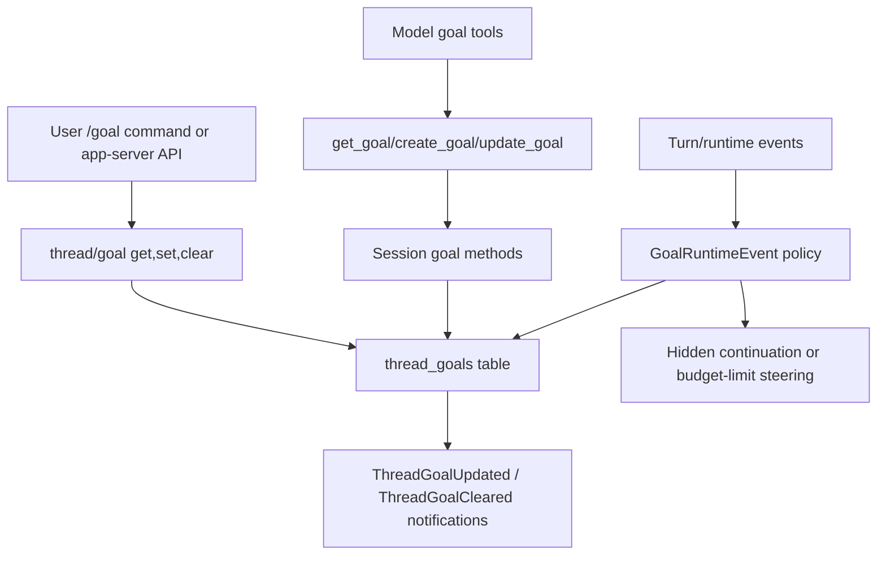

# Codex Goal Alignment For Argus

Date: 2026-05-07

This note records how OpenAI Codex implements persisted thread goals and the minimal Argus capability set needed to align with that design without mixing it with existing frozen-goal or autonomy-flow behavior.

## Upstream Sources

- Feature gate: [`codex-rs/features/src/lib.rs`](https://raw.githubusercontent.com/openai/codex/main/codex-rs/features/src/lib.rs)
- Goal persistence migration: [`codex-rs/state/migrations/0029_thread_goals.sql`](https://raw.githubusercontent.com/openai/codex/main/codex-rs/state/migrations/0029_thread_goals.sql)
- State runtime: [`codex-rs/state/src/runtime/goals.rs`](https://raw.githubusercontent.com/openai/codex/main/codex-rs/state/src/runtime/goals.rs)
- Core runtime: [`codex-rs/core/src/goals.rs`](https://raw.githubusercontent.com/openai/codex/main/codex-rs/core/src/goals.rs)
- Model tool specs: [`codex-rs/core/src/tools/handlers/goal_spec.rs`](https://raw.githubusercontent.com/openai/codex/main/codex-rs/core/src/tools/handlers/goal_spec.rs)
- Model tool handlers: [`codex-rs/core/src/tools/handlers/goal.rs`](https://raw.githubusercontent.com/openai/codex/main/codex-rs/core/src/tools/handlers/goal.rs)
- App-server processor: [`codex-rs/app-server/src/request_processors/thread_goal_processor.rs`](https://raw.githubusercontent.com/openai/codex/main/codex-rs/app-server/src/request_processors/thread_goal_processor.rs)
- TUI goal commands: [`codex-rs/tui/src/chatwidget/slash_dispatch.rs`](https://raw.githubusercontent.com/openai/codex/main/codex-rs/tui/src/chatwidget/slash_dispatch.rs), [`codex-rs/tui/src/app/thread_goal_actions.rs`](https://raw.githubusercontent.com/openai/codex/main/codex-rs/tui/src/app/thread_goal_actions.rs)
- Continuation prompt: [`codex-rs/core/templates/goals/continuation.md`](https://raw.githubusercontent.com/openai/codex/main/codex-rs/core/templates/goals/continuation.md)
- Budget-limit prompt: [`codex-rs/core/templates/goals/budget_limit.md`](https://raw.githubusercontent.com/openai/codex/main/codex-rs/core/templates/goals/budget_limit.md)

## Codex Call Logic

Codex has three entry paths into one persisted thread-goal state machine.



### User Control Path

- `/goal` without args reads the current goal and shows objective, status, elapsed time, token usage, and budget.
- `/goal <objective>` creates or replaces the current thread goal after validating the objective length.
- `/goal pause`, `/goal resume`, and `/goal clear` are user-controlled lifecycle operations.
- App-server exposes the same control plane through `thread/goal/get`, `thread/goal/set`, and `thread/goal/clear`.
- App-server mutations reconcile the rollout first, persist the goal, emit ordered goal notifications, then apply runtime effects to a running thread when present.

### Model Tool Path

Codex exposes exactly three model-visible tools when the `goals` feature is enabled:

| Tool | Purpose | Guardrail |
| --- | --- | --- |
| `get_goal` | Read the current thread goal and remaining token budget | No mutation |
| `create_goal` | Start a new active goal only when explicitly requested | Fails if the thread already has a goal |
| `update_goal` | Mark the existing goal achieved | Only accepts `status: "complete"` |

The model cannot pause, resume, clear, or budget-limit a goal. Those transitions belong to the user or runtime. When `update_goal` completes a budgeted goal, the tool response includes a final budget report so the model can tell the user how many tokens/time were consumed.

### Runtime Path

Codex core treats goal handling as a runtime policy applied to events:

- `TurnStarted` captures the active goal and token baseline.
- `ToolCompleted` accounts token/time progress and may trigger budget-limit steering.
- `ToolCompletedGoal` accounts completion usage before `update_goal` marks the goal complete.
- `TurnFinished` finalizes accounting and can schedule continuation when the session is idle.
- `TaskAborted` pauses or clears stopped runtime state so active goals do not keep running blindly.
- `ThreadResumed` restores accounting and can continue an active goal after the resumed snapshot is emitted.
- `MaybeContinueIfIdle` starts pending work first, then starts a goal-continuation turn if an active goal remains.

The continuation prompt is a hidden developer message that asks the model to keep working toward the active objective, perform a strict completion audit, and call `update_goal` only when every requirement is genuinely complete. The budget-limit prompt is a hidden developer message that tells the model to stop starting new work, summarize progress, list remaining work or blockers, and leave the user with a next step.

## Core State Model

Codex stores one goal per thread:

| Field | Meaning |
| --- | --- |
| `thread_id` | Owning thread |
| `goal_id` | Version id for stale update protection |
| `objective` | User-provided objective text |
| `status` | `active`, `paused`, `budget_limited`, or `complete` |
| `token_budget` | Optional positive token budget |
| `tokens_used` | Accounted goal token usage |
| `time_used_seconds` | Accounted wall-clock goal time |
| `created_at_ms` / `updated_at_ms` | Persistence timestamps |

Token usage is not raw context size. Codex counts goal tokens as input tokens minus cached input tokens plus output tokens. Budget exhaustion is a soft stop: the current turn is allowed to wrap up, but the goal status becomes `budget_limited`.

## Argus Current Gap

Argus currently has related but non-equivalent concepts:

- OpenMythos frozen goal reminders keep the current user intent visible, but they are not a persisted thread goal.
- Autonomy flows track managed multi-step work, but they are flow records, not one active thread goal with budget accounting.
- Session token and Hub usage reporting exist, but they are not linked to a per-thread goal lifecycle.
- There are no model-visible `get_goal`, `create_goal`, or `update_goal` tools.
- There is no user-facing `/goal` or equivalent UI control for pause/resume/clear.
- There is no idle continuation loop driven by persisted goal state.

Do not merge Codex Goal into OpenMythos frozen goal. Frozen goal is an advisory prompt layer; Codex Goal is a persisted control plane.

## Argus Required Capability Set

Argus should implement the following minimal set to align with Codex.

### 1. Feature Gate

- Add a `goals.enabled` setting, default `false`.
- New sessions expose goal tools only when the setting is enabled.
- Existing sessions should keep their launched tool surface until restarted, matching current subagent feature-gate behavior.

### 2. Goal Store

Add local thread-goal persistence owned by the Argus/MTL-code runtime boundary:

```ts
type ThreadGoalStatus = 'active' | 'paused' | 'budget_limited' | 'complete';

type ThreadGoal = {
  threadId: string;
  goalId: string;
  objective: string;
  status: ThreadGoalStatus;
  tokenBudget?: number | null;
  tokensUsed: number;
  timeUsedSeconds: number;
  createdAtMs: number;
  updatedAtMs: number;
};
```

The store must enforce one goal per thread, positive budgets, objective trimming, objective length limits, and stale update protection via `goalId`.

### 3. User/API Control Plane

Add backend APIs for UI and future automation:

| API | Behavior |
| --- | --- |
| `GET /api/sessions/:sessionId/goal` | Read current goal |
| `PUT /api/sessions/:sessionId/goal` | Create, replace, pause, resume, or adjust budget |
| `DELETE /api/sessions/:sessionId/goal` | Clear current goal |

Only this control plane may pause, resume, clear, replace, or budget-limit goals. The UI can later expose this as `/goal`, a composer command, or a compact status popover.

### 4. Model Tools

Add built-in tools in `claude-code` with Codex-compatible names and schemas:

- `get_goal({})`
- `create_goal({ objective, token_budget? })`
- `update_goal({ status: "complete" })`

The tool response should be JSON text with:

```json
{
  "goal": null,
  "remaining_tokens": null,
  "completion_budget_report": null
}
```

Use camelCase or snake_case only where the existing local tool conventions require it, but keep model-visible tool names and argument names aligned with Codex.

### 5. Runtime Accounting

Goal accounting should run at the same lifecycle points as Codex:

- On turn start, capture active goal id and usage baseline.
- After successful tool calls, account token/time deltas.
- On turn finish or abort, account final usage.
- When `tokensUsed >= tokenBudget`, mark `budget_limited` and inject budget-limit steering once.
- When `update_goal` completes the goal, account final usage before setting `complete`.

Argus should reuse existing session token accounting where possible, but store goal-specific deltas separately from global usage and Hub usage.

### 6. Idle Continuation

When a thread is idle and its goal is `active`, Argus should enqueue a hidden continuation turn using the Codex-style continuation prompt. Continuation must be suppressed when:

- Plan mode is active.
- A user turn is already pending or running.
- The goal is `paused`, `budget_limited`, or `complete`.
- The session has no materialized transcript to resume safely.

### 7. UI Surface

The first UI surface can stay small:

- Show current goal status near the composer/status area.
- Provide set, pause, resume, and clear actions.
- Show time used and tokens used/budget when available.
- Prompt to resume a paused goal after opening a saved session.

Avoid creating a large new workflow screen before the runtime contract is stable.

## Suggested Local Ownership

| Capability | Likely owner |
| --- | --- |
| Goal feature setting | `claudecodeui` settings state and runtime env mapping |
| Session goal APIs | `claudecodeui/server` routes/services |
| Goal persistence | new `claudecodeui/server/services/session-goal-service.*` or `claude-code/src/tasks/threadGoal*.ts`, depending on where session id ownership is finalized |
| Built-in goal tools | `claude-code/packages/builtin-tools/src/tools/GoalTool/*` |
| Tool publishing gate | `claude-code/src/tools.ts` |
| Runtime accounting and continuation | `claude-code/src/screens/REPL.tsx`, `src/utils/handlePromptSubmit.ts`, and shared session runtime helpers |
| UI status/control | `claudecodeui/src/components/chat/view/subcomponents/ChatComposer.tsx` and related chat state hooks |

## Implementation Order

1. Add tests and store/service for `ThreadGoal` CRUD and budget validation.
2. Add backend session goal APIs without UI.
3. Add feature gate plumbing from settings into launched `claude-code` runtime.
4. Add `get_goal`, `create_goal`, and `update_goal` tools, still without idle continuation.
5. Add accounting hooks and budget-limit steering.
6. Add idle continuation.
7. Add compact UI controls and status display.

This order keeps the persistent state and tool contract testable before enabling autonomous continuation.

## Non-Goals

- Do not make every normal task a goal. `create_goal` should only be used when the user explicitly asks for a persistent goal or long-running continuation.
- Do not let the model pause, resume, clear, or replace goals.
- Do not treat OpenMythos frozen goal reminders as goal persistence.
- Do not reuse subagent mailbox or graph state for goal lifecycle.
- Do not make budget exhaustion a hard process kill; it is a soft wrap-up state.

## Open Questions

- Should Argus expose `/goal` text commands in the web composer, a button/popover, or both?
- Should goal persistence live in the UI server database or under the `claude-code` session directory so CLI-only sessions can use it later?
- Which exact local token counter should be the source of truth for goal deltas across Anthropic-compatible, Codex, and Gemini providers?
- Should Hub usage reports optionally include goal id/objective labels, or should goals stay local-only for privacy?
