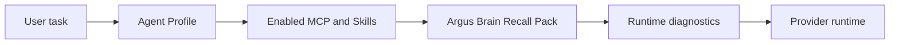

# Argus Brain Runtime

Updated: 2026-05-19

Argus Brain is the local task working-memory layer for long work: it captures task events, compacts them into a small Mermaid canvas, recalls the current goal and next action, and exposes diagnostics with evidence refs.

## Boundaries

- Claude native memory owns user preferences, collaboration habits, and ordinary remember or forget requests.
- Argus Brain owns local task state: commands, assistant summaries, runtime events, checkpoints, artifacts, decisions, risks, blockers, and next actions.
- MCP servers, Skills, and Agent Profiles own external knowledge, code search, impact analysis, enterprise systems, and other optional capabilities.
- Brain does not scan external stores and does not replace current-file verification.

## Runtime Flow

1. Settings load `argusBrain` from the model settings file.
2. Before a provider command runs, Agent Profile runtime settings and uploaded files are applied, then Brain may append a short `Argus Brain Recall Pack` block.
3. During the run, the WebSocket writer captures normalized runtime events for tools, errors, assistant summaries, checkpoints, and artifacts.
4. After the run, Brain stores events and refs in local SQLite tables, prunes retention, and compacts when thresholds are reached.
5. Runtime diagnostics show Brain recall, timeline state, tool calls, token usage, retries, and permission blocks.

## Storage

Brain uses local SQLite tables:

- `brain_sessions`
- `brain_events`
- `brain_refs`
- `brain_nodes`
- `brain_compactions`
- `brain_atoms`
- `brain_scenarios`
- `brain_project_profiles`
- `brain_retrieval_runs`

Every row is scoped by `sessionId`; project, provider, checkpoint, and artifact ids are optional tracking fields. Raw refs stay local and are redacted before capture.

## Prompt Contract

The injected block is named `Argus Brain Recall Pack`. It must stay short and must not include raw logs. It tells the model that Brain is task state, not a live source index, and current files, settings, and runtime results must be verified before acting.

See [2026-05-19-brain-mcp-runtime.md](2026-05-19-brain-mcp-runtime.md) for user-facing runtime boundaries and legacy knowledge migration.
