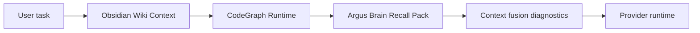

# Argus Brain Runtime

Updated: 2026-05-19

Argus Brain replaces the old OpenMythos runtime surface. It is a local task working-memory layer for long work: capture task events, compact them into a small Mermaid canvas, recall the current goal and next action, and expose diagnostics with evidence refs.

## Boundaries

- Claude native memory owns user preferences, collaboration habits, and ordinary remember or forget requests.
- Obsidian is a Wiki and knowledge base. It provides historical project readback and explicit save-to-Wiki candidates only.
- Argus Brain owns local task state: commands, assistant summaries, runtime events, checkpoints, artifacts, decisions, risks, blockers, and next actions.
- Brain never writes Obsidian notes and does not override Claude native memory paths.

## Runtime Flow

1. Settings load `argusBrain` from the model settings file. Old `openMythosRuntime` fields are ignored as legacy data.
2. Before a provider command runs, Obsidian Wiki readback and CodeGraph context are applied, then Brain recall appends a short `Argus Brain Recall Pack` block when useful.
3. During the run, the WebSocket writer captures normalized runtime events for tools, errors, assistant summaries, checkpoints, and artifacts.
4. After the run, Brain stores events and refs in local SQLite tables, prunes retention, and compacts when thresholds are reached.
5. Context fusion diagnostics show source order, source boundaries, per-source token estimates, and Brain hits deduplicated against Obsidian sources.
6. Diagnostics read the latest Brain canvas, recall hits, token reduction estimate, active decisions, open risks, and raw ref metadata.

## Storage

Brain uses local SQLite tables:

- `brain_sessions`
- `brain_events`
- `brain_refs`
- `brain_nodes`
- `brain_compactions`
- `brain_atoms`
- `brain_scenarios`
- `brain_project_profiles`
- `brain_retrieval_runs`

Every row is scoped by `sessionId`; project, provider, checkpoint, and artifact ids are optional tracking fields. Raw refs stay local and are redacted before capture.

Brain v2 keeps layered task memory:

- Raw runtime evidence stays in `brain_events` and `brain_refs`.
- Compact task state is summarized in `brain_compactions`.
- Durable task facts, decisions, risks, and lessons become `brain_atoms`.
- Reusable workflow situations become `brain_scenarios`.
- Project-level habits and module maps become `brain_project_profiles`.
- Retrieval runs record hybrid recall diagnostics for later inspection.

## Prompt Contract

The injected block is named `Argus Brain Recall Pack`. It must stay short and must not include raw logs. It tells the model that Brain is task state, not source material, and current files, code, settings, and runtime results must be verified before acting.

Context fusion applies these boundaries:

1. Obsidian Wiki Context is source material, not task state.
2. Argus Brain is task state, not source material.
3. Current code, settings, and runtime results must be verified before acting on historical context.

See [2026-05-19-brain-obsidian-context-guide.md](2026-05-19-brain-obsidian-context-guide.md) for user-facing troubleshooting and migration steps.

## OpenMythos Status

OpenMythos is removed from the active runtime surface: no settings tab, no diagnostics card, no launch env injection, no prompt strategy card, and no user-facing runtime control. Historical notes may still mention it for migration context, but new implementation should use Argus Brain.
