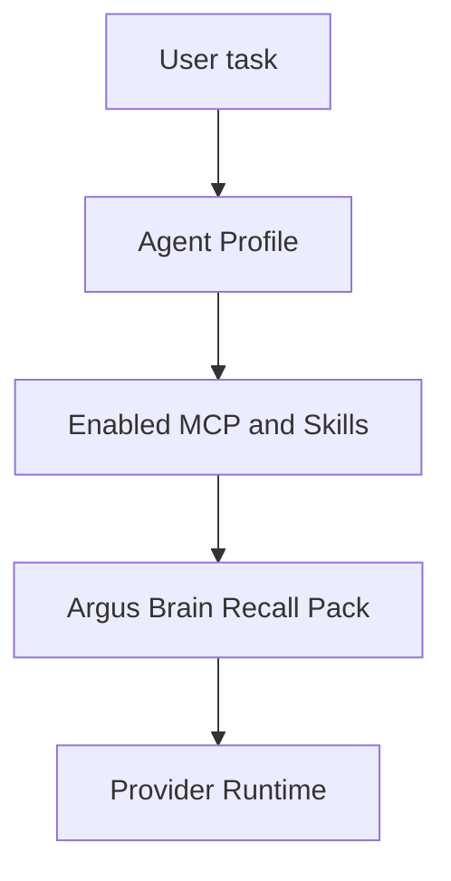

# Argus Brain + MCP Runtime Guide

## Built-In Memory Boundary

Argus Brain is the only built-in project memory surface. It stores task state, project profile summaries, decisions, risks, compacted session state, and recall atoms that help an agent resume work.

External knowledge, code search, impact analysis, repository indexes, company tools, and local enterprise systems are no longer bundled as dedicated product surfaces. Users connect those capabilities through MCP servers, Skills, Marketplace packages, and Agent Profiles.

## Runtime Flow

Runtime diagnostics report profile/runtime state, Brain recall, tool calls, token usage, permission blocks, retries, and agent timeline events. They do not report retired built-in external-source token buckets.

## Legacy Knowledge Migration

The migration only reads Argus-known legacy records. It does not scan a user vault or external folder.

- `GET /api/brain/legacy-knowledge/preview`
- `POST /api/brain/legacy-knowledge/import`

Preview shows what can be migrated into Brain atoms and project profiles. Import is idempotent by stable key, so running it more than once does not create duplicates.

## Product Rule

When a capability is too specific for the core product, create or install an MCP/Skill package and bind it through an Agent Profile. Do not add a dedicated built-in route, settings tab, sidebar button, or runtime source unless there is a separate approved requirement.
