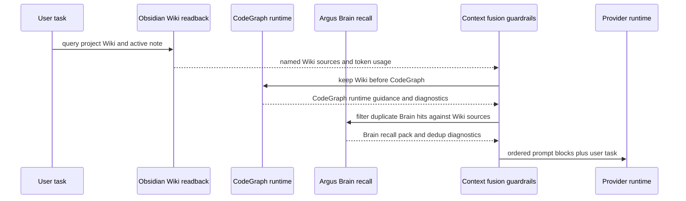
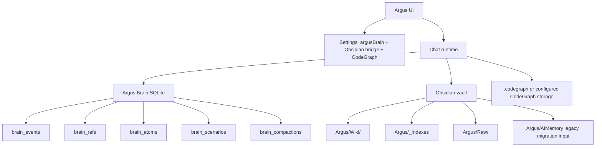

# Argus Brain + Obsidian Context Guide

Updated: 2026-05-19

This guide explains the current memory and knowledge surfaces in Argus: Claude native memory, Argus Brain, Obsidian Wiki, semantic readback, CodeGraph, and the diagnostics that show what reached the model prompt.

## When To Use Which Memory

| Need | Use | Why |
| --- | --- | --- |
| User preference, collaboration habit, personal style, ordinary remember/forget | Claude native memory | It is the user's durable personal memory and should not be mixed with project Wiki notes. |
| Current task state, decisions made during a run, next action, blockers, checkpoint refs | Argus Brain | Brain is local task state. It recalls what happened in this work thread and always requires current code/runtime verification. |
| Project knowledge, architecture notes, source summaries, release decisions, review notes | Obsidian Wiki | Wiki is source material. It is durable, human-readable, auditable, and read back only from allowed folders. |
| Structural code lookup, symbol/module impact, exact file relationships | CodeGraph | CodeGraph is code structure. It can guide search, but stale or missing output must fall back to raw file inspection. |
| Legacy generated notes under `Argus/AIMemory` | Migration input only | AIMemory is no longer the default readback location. Migrate useful notes into `Argus/Wiki/<project>` or archive them. |

Prompt boundary rule:

1. Obsidian Wiki Context is source material, not task state.
2. Argus Brain is task state, not source material.
3. Current code, settings, and runtime results must be verified before acting on historical context.

## Runtime Flow

Final prompt order:

1. System/profile/runtime prompt.
2. `Argus Wiki Context` from Obsidian readback.
3. `CodeGraph Runtime`.
4. `Argus Brain Recall Pack`.
5. User task.

The implementation path is:

- `applyObsidianContextToChatCommand()` adds the `Argus Wiki Context` block.
- `applyCodeGraphRuntimeToChatCommand()` adds `CodeGraph Runtime` after Wiki context.
- `brainRecallService.applyToChatCommand()` adds `Argus Brain Recall Pack`.
- `context-fusion-guardrail-service.js` records `options.contextFusion`, source order, boundaries, per-source token estimates, and Brain-vs-Wiki dedup results.

Current route anchors:

- `/api/obsidian-bridge/health`
- `/api/obsidian-bridge/semantic-index/status`
- `/api/obsidian-bridge/semantic-index/capabilities`
- `/api/obsidian-bridge/semantic-index/query`
- `/api/obsidian-bridge/wiki/folder-policy`
- `/api/obsidian-bridge/wiki/migration-preview`
- `/api/obsidian-bridge/wiki/candidates`
- `/api/brain/session/:sessionId/inspector`
- `/api/brain/session/:sessionId/canvas`
- `/api/codegraph/status`

## Storage Layers

Argus Brain stores local task state in SQLite:

- `brain_sessions`
- `brain_events`
- `brain_refs`
- `brain_atoms`
- `brain_scenarios`
- `brain_compactions`
- `brain_project_profiles`
- `brain_retrieval_runs`

Obsidian Wiki stores human-readable project knowledge:

- `Argus/Wiki/<project>` for curated project notes.
- `Argus/_Indexes` for generated indexes and maps.
- `Argus/Raw/<project>` for imported source material before compilation.
- `Argus/AIMemory` only as legacy read-only migration input unless the user explicitly chooses otherwise.

## Obsidian Semantic Retrieval

Semantic readback is layered:

1. Read the configured bridge state.
2. Detect the read-only provider: bridge, local HTTP, MCP stdio, or keyword fallback.
3. Query semantic results when a provider is available.
4. Fall back to keyword results when semantic search is disabled, unavailable, timed out, or missing metadata.
5. Build source-aware snippets with stable paths, block ids, reasons, and token budgets.

Common semantic states:

| State | Meaning | User action |
| --- | --- | --- |
| `semantic-disabled` | Semantic provider is intentionally disabled. | Enable semantic readback or accept keyword-only fallback. |
| `provider-unavailable` | Configured provider is not reachable. | Check bridge, local service, or MCP stdio setup. |
| `index-metadata-missing` | Provider exists but has no usable index metadata. | Rebuild or refresh the local semantic index. |
| `semantic-query-failed` | Query failed at runtime. | Inspect the error, then retry with keyword fallback enabled. |
| `keyword-fallback-ready` | Keyword search is available as a fallback. | Continue; answers may be less semantic but should not block. |

## Troubleshooting Playbooks

### No Recall

Symptoms:

- Brain panel is empty.
- `brainRecall.status` is `disabled`, `no-scope`, or `empty`.
- The prompt has no `Argus Brain Recall Pack`.

Checks:

1. Confirm Argus Brain is enabled in Runtime Settings.
2. Use `/api/brain/session/:sessionId/inspector` to verify session scope, latest compaction, recall hits, and node evidence.
3. Confirm the command has a real session id or project name.
4. If no data exists, continue the task or import a Brain package; Brain cannot recall what was never captured.

### Stale Recall

Symptoms:

- Brain recalls an old decision that current files no longer support.
- The prompt says to verify historical Brain state.

Checks:

1. Treat Brain as task state, not truth.
2. Inspect current files and runtime output first.
3. Use Brain node evidence from `/api/brain/session/:sessionId/node/:nodeId` before trusting a recalled decision.
4. Add a new task note or decision in the current run; do not edit historical atoms by hand unless using the atom control UI/API.

### Too Much Context

Symptoms:

- The model receives too much Wiki/Brain context.
- `options.contextFusion.totalInjectedTokens` is high.

Checks:

1. Inspect `options.contextFusion.sources.obsidian.injectedTokens`, `.codegraph.injectedTokens`, and `.brain.injectedTokens`.
2. Lower Wiki max results or max tokens per source.
3. Disable one source independently: Brain recall, Obsidian readback, semantic index, or CodeGraph.
4. Prefer explicit selected Obsidian sources when the user knows the relevant notes.

### No Obsidian Results

Symptoms:

- Search/context returns zero results.
- Health states include `no-wiki-notes`.

Checks:

1. Open `/api/obsidian-bridge/health`.
2. Confirm readable folders include `Argus/Wiki` or `Argus/_Indexes`.
3. Try `/api/obsidian-bridge/search` with a known project term.
4. Try `/api/obsidian-bridge/semantic-index/query`; if it fails, confirm keyword fallback is ready.

### Bridge Disconnected

Symptoms:

- Health states include `disabled`, `not-installed`, `not-paired`, `wrong-vault`, or `stale-token`.
- `Test connection` fails.

Checks:

1. Enable Obsidian Bridge in Settings when state is `disabled`.
2. Reinstall the plugin when state is `not-installed`.
3. Reconnect pairing when state is `not-paired` or `stale-token`.
4. Select the correct vault when state is `wrong-vault`.
5. Confirm Obsidian Desktop is open and the plugin endpoint is listening.

### Index Missing

Symptoms:

- Health state includes `indexing-missing`.
- CodeGraph or semantic notes are unavailable.

Checks:

1. Open `/api/codegraph/status`.
2. Configure `codegraphStorageRoot` or initialize CodeGraph for the project.
3. Run CodeGraph sync/export only as an explicit maintenance action, not during normal chat.
4. Recheck `/api/obsidian-bridge/health`.

### Duplicate Wiki Notes

Symptoms:

- Obsidian contains repeated notes with suffixes such as `2`, `3`, or `4`.
- Wiki candidates warn about duplicate targets.

Checks:

1. Use `/api/obsidian-bridge/duplicates/scan`.
2. Archive duplicates through `/api/obsidian-bridge/duplicates/archive`.
3. For new explicit Wiki writes, review `/api/obsidian-bridge/wiki/candidates` before commit.
4. Preserve user-authored notes; generated duplicates should be archived, not deleted.

## Migration Guide

### From Current Brain Schema

1. Keep existing Brain SQLite data; no destructive migration is required.
2. Use `/api/brain/session/:sessionId/retention-preview` before pruning old runs.
3. Export important sessions through `/api/brain/session/:sessionId/export`.
4. Import portable Brain packages through `/api/brain/import` when moving between machines.
5. Use Brain inspector reports to verify that compactions, atoms, scenarios, and refs still resolve.

### From Old AIMemory Notes

1. Treat `Argus/AIMemory` as legacy read-only migration input.
2. Run `/api/obsidian-bridge/wiki/migration-preview` before moving notes.
3. Move durable project knowledge to `Argus/Wiki/<project>`.
4. Archive generated or low-confidence legacy notes that should not be read back.
5. Keep personal preferences in Claude native memory, not project Wiki.

### From Removed OpenMythos Notes

OpenMythos is historical migration context only. Do not create new product flows, settings, diagnostics, prompt cards, or user-facing instructions that depend on OpenMythos. Use:

- Argus Brain for task working memory.
- CodeGraph for code structure.
- Obsidian Wiki for durable project knowledge.
- Subagents only through the explicit subagent feature gate.

## Verification

Useful automated checks:

- `npm run test:unit -- server/services/tests/knowledge-docs-source.test.mjs`
- `npm run test:unit -- server/services/tests/context-fusion-guardrail-service.test.mjs`
- `npm run test:unit -- server/services/tests/obsidian-bridge-health.test.mjs`
- `npm run test:unit -- server/services/tests/obsidian-semantic-index-route.test.mjs`
- `npm run typecheck`

Useful manual checks:

1. Open Settings -> Runtime -> Obsidian.
2. Run Test connection and Health.
3. Run semantic status/query.
4. Send a chat message in a project with Wiki readback enabled.
5. Confirm diagnostics show `Argus Wiki Context`, `CodeGraph Runtime`, `Argus Brain Recall Pack`, and `contextFusion` token accounting.
