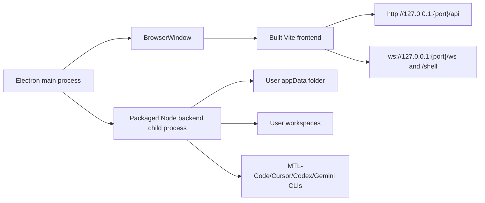

# Desktop Packaging Plan

## Recommended Direction

Use Electron as the desktop shell and keep the existing Node/Express backend as a packaged child process.

This is the lowest-risk path for this repository because the backend already depends on Node-native/runtime-heavy pieces such as `node-pty`, `better-sqlite3`, provider CLIs, WebSocket handling, and filesystem access. Electron gives us a native window and installer ecosystem while allowing the backend to stay close to its current shape.

## Target Runtime Shape



## Build Outputs

- Frontend: `npm run build:client` produces `dist/`.
- Backend: `npm run build:server` produces `dist-server/`.
- Desktop shell: `desktop/main.ts` starts the backend on an ephemeral localhost port, then loads `dist/index.html` with that port injected.
- Installer: `electron-builder` produces a Windows NSIS installer first, then macOS/Linux targets later.

## Backend Desktop Mode

Add `DESKTOP_MODE=true` for the packaged child process.

In desktop mode:

- Bind backend to `127.0.0.1` only.
- Pick an ephemeral port to avoid conflicts.
- Disable app JWT/API-key middleware for local app routes.
- Keep provider auth behavior inside provider CLIs where required.
- Store SQLite, logs, plugin folders, and app config under Electron `app.getPath('userData')`.
- Set `MTL_CODE_CLI_PATH` to the bundled or discovered `mtl-code` executable.
- Keep `CLAUDE_CLI_PATH` only as a legacy fallback for old development environments.
- Avoid writing generated runtime state back into the install directory.

## Electron Main Process

Responsibilities:

- Resolve packaged paths for `dist/`, `dist-server/`, and bundled runtime files.
- Start backend with environment:
  - `DESKTOP_MODE=true`
  - `HOST=127.0.0.1`
  - `PORT=<free-port>`
  - `APP_DATA_DIR=<electron userData>`
- Wait for `/health` before showing the main window.
- Stop backend on app quit.
- Surface backend startup errors in a small native error window.

## Packaging Scripts

Suggested scripts:

```json
{
  "build:desktop": "npm run build && electron-builder --dir",
  "dist:win": "npm run build && electron-builder --win nsis",
  "dist:mac": "npm run build && electron-builder --mac",
  "dist:linux": "npm run build && electron-builder --linux AppImage deb"
}
```

Current Windows implementation:

- Project-level `.npmrc` uses `registry.npmmirror.com`, Electron mirror, and electron-builder binary mirror.
- `electron/main.mjs` starts the built Express backend as a child process, waits for `/health`, then opens a native `BrowserWindow`.
- `build.extraMetadata.main` overrides the packaged Electron app entry to `electron/main.mjs`; the source package `main` remains `dist-server/server/index.js` for the npm/server runtime.
- `scripts/package-electron-win.mjs` runs the web/server build, stages `electron-resources/runtime/node.exe`, stages the built `../claude-code/dist` backend, then invokes `electron-builder --win nsis --x64`.
- `npm run package:electron-win` writes outputs under `../workspace/vendor/electron-dist`.
- Windows signing and executable metadata editing are disabled for the first local package with `CSC_IDENTITY_AUTO_DISCOVERY=false` and `win.signAndEditExecutable=false`; this avoids the `winCodeSign` symbolic-link extraction failure on machines without symlink privileges.
- On Windows with Node 24, `spawnSync('npm.cmd', ...)` can fail with `EINVAL`. `scripts/package-electron-win.mjs` wraps `.cmd` commands with `cmd.exe /d /s /c` so `npm run build` and `npx electron-builder` work inside the packaging script.
- Application-level icons are generated from `public/icons/argus-icon.svg` by `npm run icons:app`. The generated `public/icon.ico` is used by `build.win.icon`, NSIS installer icons, desktop shortcuts, and the taskbar/startup shell. PWA/favicon/logo PNGs are generated from the same source.

## Native Dependency Strategy

Prefer launching a packaged Node backend child process instead of importing backend code into Electron main. This avoids Electron ABI rebuild friction for `better-sqlite3` and `node-pty`.

If the installer must be fully self-contained, bundle a known-good Node runtime with the app and run `dist-server/server/index.js` through that runtime.

## Phases

1. Add backend `DESKTOP_MODE` and local auth bypass.
2. Add `desktop/main.ts` and a minimal Electron window.
3. Inject backend base URL into the frontend at runtime.
4. Move app data paths to Electron `userData`.
5. Add `electron-builder` config for Windows NSIS.
6. Smoke test install, first launch, project creation, chat, file tree, shell, MCP, and TaskMaster.
7. Add auto-update later, after installer signing and release channel are stable.

## MTL-Code Bundle Strategy

For the first Windows installer, prefer a self-contained bundle:

- Build `../claude-code` as the `mtl-code` CLI/backend.
- Copy the resulting `mtl-code` executable or runnable Node entry into the desktop app resources.
- Launch the UI backend with `MTL_CODE_CLI_PATH=<resources>/mtl-code`.
- Keep project history under `~/.mtl-code/projects`, while reading `~/.claude/projects` as legacy history.

## Alternative

Tauri plus a Node sidecar can produce a smaller app, but it adds Rust-sidecar coordination without reducing the current backend complexity. Use it later only if installer size becomes a hard product requirement.
