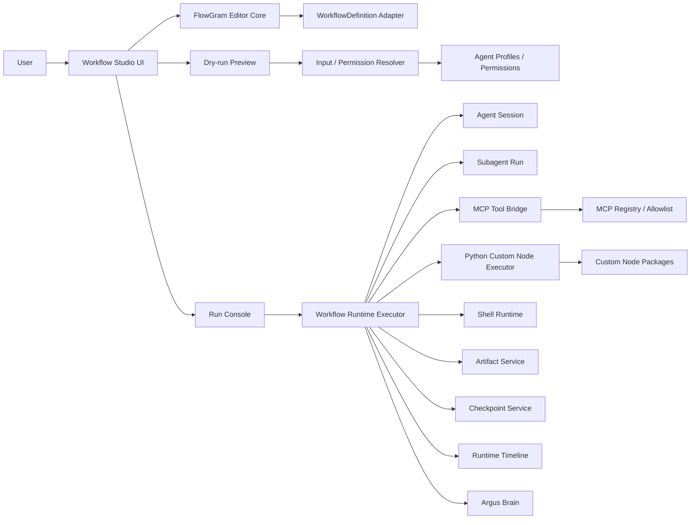

# Workflow Studio 后续功能策划案

更新时间：2026-05-21

适用范围：MTL-Code / Argus 的 Workflow Studio 后续功能规划。

本文档只规划 Workflow Studio 后续开发，不恢复旧 Swarm，不恢复 Obsidian、内置 CodeGraph、小模型 runtime，不新增移动端专项。后续执行时仍然遵守“先建 GitHub issue + 看板单，再实现；新问题先提单，不顺手做”的规则。

## 1. 当前状态

Workflow Studio 已经从早期的自研画布逐步推进到 FlowGram 画布，并完成了若干关键基础能力：

- 已有 Library / Editor / Runs 三个核心视图。
- 已有 FlowGram 画布、节点添加、边编辑、基础 Inspector 和运行状态展示。
- 已完成默认 UI 降噪，进入 Simple Mode 后只暴露少量主路径操作。
- 已完成 OpenCode 风格 subagent 重构，Workflow 可以把 subagent 作为节点能力使用。
- 已完成 AI 生成 Python 自定义节点第一阶段：
  - 用户可以生成 Python 节点草稿。
  - manifest 强制 `manifestVersion: "1"`。
  - 只允许标准库依赖。
  - Python 执行协议使用 JSON stdin / stdout。
  - 有 timeout、payload size、stderr log、错误分类。
  - 安装后节点进入 Workflow palette 的 Custom 分组。
- 已完成自定义节点契约强化：
  - dry-run 能校验自定义节点 `inputSchema`、`configSchema` 和变量依赖。
  - Python 节点真实执行后会校验 `outputSchema`。
- 已完成 workflow dry-run preview：
  - `POST /api/workflows/:id/validate-run` 返回每个节点的 resolved input、permission decision、blocked 状态和 node errors。
  - 前端有轻量 Dry run preview 面板。

这些能力说明产品已经不再只是“能画 DAG”，而是具备了 Agent / Subagent / MCP / Python custom node / Permission / Run preview 的核心雏形。但当前仍然有明显差距：

- dry-run preview 与真实 run 之间还没有强一致性保证。
- 自定义节点安装后缺少生命周期管理，例如禁用、卸载、升级、兼容影响分析。
- Python 自定义节点测试还是基础沙箱，缺少完整 test matrix、expected output 校验和回归记录。
- 数据流可见性还不够强，用户仍然很难判断某个字段最终来自哪里。
- workflow run 的可恢复、可复盘能力还不够硬，缺少统一 snapshot 和 replay 设计。
- MCP、Agent、Subagent 等节点的真实执行桥接还需要继续加深。
- package / template / marketplace 的治理能力还不够生产级。

## 2. 产品定位

Workflow Studio 的定位不应该是“一个画布页面”，而应该是 MTL-Code 的总编排层：

> Workflow Studio = Agent Profiles + Subagents + MCP + Python Custom Nodes + Permissions + Timeline + Checkpoints + Artifacts 的可视化编排系统。

用户最终要获得的体验是：

1. 从模板或空白 workflow 开始。
2. 使用少量主动作完成节点添加、配置、dry-run、执行。
3. 在运行前知道每个节点会拿到什么输入、会触发什么权限、缺什么依赖。
4. 运行中能看到节点状态、日志、产物、审批、失败原因。
5. 失败后能 retry、retry from node、rollback 或修改配置。
6. 完成后能得到 Artifact、Review Summary、截图证据和可审计 run story。
7. 自定义节点可以由 AI 生成，但必须经过审阅、测试、安装和契约校验。

## 3. 设计原则

### 3.1 少堆功能，多闭环

后续不要再用“再加一个面板”解决问题。每个新功能必须回答三个问题：

- 用户在什么时刻会需要它？
- 它如何减少用户的不确定性？
- 它如何进入验收证据，而不是只停留在 UI 元素？

### 3.2 Preview 和 Run 必须一致

用户点击 Run 前看到的 dry-run preview，必须尽量接近真实执行输入。如果真实运行时发生偏移，系统要告诉用户偏移来自哪里，而不是让用户在日志里猜。

### 3.3 Schema 是自定义节点的唯一 UI 协议

AI 生成节点只生成 manifest、schema、Python code、test cases。前端不接受 AI 生成 React / TSX UI。所有节点配置统一通过 schema form 渲染，避免 UI 注入和风格失控。

### 3.4 高风险节点永远走权限和审批

Shell、MCP、Git、文件写入、外部网络、secret 访问等能力不能因为放进 workflow 就绕过权限。Workflow 节点只能继承或收紧 Agent Profile 权限，不能放大权限。

### 3.5 Runtime 证据优先

执行类需求关闭时必须有真实 run 证据。UI 类需求必须有桌面 Playwright 截图。权限类需求必须有 allow / ask / deny 证据。不能只靠 source contract 或 testid。

### 3.6 不做移动端专项

当前阶段不再规划移动端编辑、移动端审批或移动端截图门禁。桌面端是唯一主路径。移动端只保持不明显破坏，不作为需求目标。

## 4. 系统边界

边界说明：

- FlowGram 负责编辑体验、节点/边交互、form/variable/history 能力。
- Workflow Studio UI 负责把 FlowGram 的编辑状态翻译成用户能理解的创建、配置、预览、运行、复盘路径。
- WorkflowDefinition 仍然是后端 wire shape，不把后端绑定到 FlowGram 内部结构。
- Runtime 负责执行、审批、checkpoint、artifact、timeline、Brain 写入。
- Python 自定义节点通过 package manifest 管理，运行时必须走受限 executor。
- MCP 节点必须通过已配置 MCP server/tool 和 allowlist，不允许任意动态调用。

## 5. 后续需求拆分

以下需求从 `REQ-210` 开始，承接当前已完成的 `REQ-207`、`REQ-208`、`REQ-209`。每张单都必须能独立验收、独立关闭，不使用 `V1/V2/V3`。

### REQ-210 Workflow Preview to Run Consistency

背景：

当前 dry-run preview 已经能展示每个节点的 resolved input、permission decision 和 blocked 状态，但真实 run 是否严格复用同一套解析结果还没有强约束。如果用户在 Run 前看到的是 A，真实执行时变成 B，Workflow Studio 的可信度会下降。

用户目标：

用户点击 Run 前能明确知道每个节点将收到什么输入、会触发什么权限、是否会被阻塞；点击 Run 后能确认真实执行和预览一致，或者看到明确的差异说明。

功能范围：

- 后端为每次 run 保存 `previewSnapshot`。
- run start 使用与 validate-run 相同的 resolver 生成 `executionInputSnapshot`。
- 对比 `previewSnapshot` 与 `executionInputSnapshot`：
  - 完全一致：标记 `previewMatched: true`。
  - 不一致：记录差异字段、原因、时间。
- Runs UI 展示 Preview matched / Preview changed 状态。
- 节点详情展示 preview input 与 execution input diff。

不做什么：

- 不改变现有 workflow 执行语义。
- 不新增新的节点类型。
- 不引入复杂可视化 diff 编辑器，第一阶段只做字段级结构化 diff。

技术实现要点：

- 抽出统一 resolver：`resolveWorkflowRunPlan(definition, inputs, profileSnapshot, packageSnapshot)`。
- `validate-run` 和 `run create` 都调用同一 resolver。
- run record 持久化：
  - `previewSnapshot`
  - `executionInputSnapshot`
  - `previewDiff`
- 差异原因初步分为：
  - `definition_changed`
  - `input_changed`
  - `profile_changed`
  - `node_package_changed`
  - `resolver_version_changed`

验收标准：

- 同一 workflow 在不变更输入和 definition 的情况下，preview 与 run input 一致。
- 修改 workflow 后运行，Run Console 能显示 preview changed。
- 修改 custom node schema 后运行，Run Console 能显示 package changed。
- 有桌面截图证明 Runs 中的 preview matched / changed 状态。

测试要求：

- resolver 单测。
- preview snapshot 持久化测试。
- preview / execution input diff 测试。
- UI source contract 和 Playwright 截图。

### REQ-211 Node Package Lifecycle Management

背景：

AI 生成 Python 自定义节点已经可以安装，但缺少完整生命周期。用户一旦安装很多节点，就需要启用、禁用、卸载、升级、查看依赖和兼容影响。

用户目标：

用户能安全管理自定义节点包，知道某个节点被哪些 workflow 使用，禁用或升级前能看到影响范围，避免运行时突然坏掉。

功能范围：

- 节点包列表显示 installed / enabled / disabled / broken / update available 状态。
- 支持 enable / disable / uninstall。
- disable / uninstall 前生成 impact report：
  - 哪些 workflow 使用该节点。
  - 哪些 templates 依赖该节点。
  - 最近哪些 run 使用过该节点。
- 支持安装同一 package 的新版本。
- 升级前做 schema compatibility check。

不做什么：

- 不做远程 marketplace 下载。
- 不做动态 pip install。
- 不做多租户权限。

技术实现要点：

- package manifest 增加 `packageVersion` 和 `compatibility` 字段。
- workflow definition 保存 node package id + version ref。
- 新增 impact report 服务：
  - 扫描 workflow definitions。
  - 扫描 template manifests。
  - 扫描 recent run snapshots。
- 禁用节点后：
  - palette 不再显示。
  - 已有 workflow 显示 dependency missing，但 definition 不自动删除。

验收标准：

- 禁用一个 custom node 后，palette 不再显示该节点。
- 使用该节点的 workflow 显示 dependency missing。
- 卸载前能看到影响的 workflow 列表。
- 升级不兼容 schema 时阻止直接升级并显示原因。

测试要求：

- package lifecycle API 单测。
- impact report 单测。
- UI 交互测试。
- 桌面截图：node package list、impact report、dependency missing。

### REQ-212 Custom Node Test Matrix

背景：

当前 Python 自定义节点沙箱可以测试草稿，但要达到生产可用，必须支持多 test case、expected output 校验、stderr/stdout 证据保留和回归结果记录。

用户目标：

用户安装 AI 生成节点前，可以看到每个测试用例是否通过、输入是什么、stdout/stderr 是什么、输出是否符合 schema。

功能范围：

- manifest `testCases[]` 支持多个用例。
- 每个 test case 支持：
  - `name`
  - `input`
  - `config`
  - `expectedOutput`
  - `expectedStatus`
  - `timeoutMs`
- test sandbox 运行全部 test cases。
- 支持 expected output subset match。
- 保存最近一次 test result。
- 安装按钮要求全部 required test case 通过。

不做什么：

- 不做真实网络测试。
- 不做并发跑测试。
- 不做第三方依赖安装。

技术实现要点：

- 扩展 `WorkflowPythonNodeTestResult`：
  - `caseName`
  - `stdout`
  - `stderr`
  - `parsedOutput`
  - `durationMs`
  - `exitCode`
  - `errorType`
  - `assertionFailures`
- expected output 使用 JSON subset matcher。
- test runner 每个 case 独立 timeout 和 payload limit。

验收标准：

- 一个 manifest 中 3 个 test cases 能全部运行并分别展示结果。
- expected output 不匹配时安装被阻止。
- stdout/stderr 在 UI 中可展开查看。
- 有截图证明多个 test case 的通过和失败状态。

测试要求：

- multiple test cases 后端测试。
- expected output subset matcher 测试。
- timeout / invalid JSON / schema mismatch 测试。
- UI review page 截图。

### REQ-213 Workflow Data Contract Debugger

背景：

Workflow 的数据流已经支持 `{{inputs.x}}` 和 `{{nodes.nodeId.output.y}}`，但用户仍然很难理解某个最终字段到底来自哪里，尤其是多个上游节点和 transform 叠加时。

用户目标：

用户能在 Run 前和 Run 后查看字段级 lineage，知道每个节点输入字段来自哪个 workflow input、哪个上游节点、哪个 output 字段，以及哪里断了。

功能范围：

- dry-run preview 中每个 resolved field 增加 lineage。
- 缺失变量错误定位到具体节点、字段、来源表达式。
- Inspector Data tab 展示可用变量、字段类型、示例值和来源。
- Runs node detail 展示 actual input lineage。

不做什么：

- 不做复杂 transform 编程语言。
- 不做跨 run 数据 lineage。
- 不做图数据库。

技术实现要点：

- resolver 输出 `ResolvedFieldTrace`：
  - `targetPath`
  - `sourceExpression`
  - `sourceKind`
  - `sourceNodeId`
  - `sourcePath`
  - `valuePreview`
  - `status`
  - `error`
- 对 prompt / command 这类字符串字段，记录模板段级 trace。
- UI 只展示安全 preview，长文本截断，完整值可复制。

验收标准：

- 缺少 `{{nodes.explore.output.summary}}` 时，UI 指向使用该变量的节点字段。
- 正常字段能显示来自 workflow input 或上游节点。
- Run 后能看到 actual input lineage。
- 有截图证明字段 lineage 和缺失变量定位。

测试要求：

- resolver lineage 单测。
- missing variable 定位测试。
- template string trace 测试。
- Data tab 截图。

### REQ-214 Workflow Run Snapshot and Replay Hardening

背景：

Workflow run 要成为可审计系统，必须保存足够的 snapshot。否则 workflow definition、node package、profile 后续变化后，历史 run 无法复盘。

用户目标：

用户能打开任意历史 run，看到当时使用的 workflow definition、profile、node package 和输入输出，而不是看到当前最新配置导致的错觉。

功能范围：

- run 创建时保存：
  - workflow definition snapshot
  - profile snapshot
  - permission snapshot
  - node package manifest snapshot
  - run inputs snapshot
  - resolver version
- replay 基于 event log + snapshots 重建 run 状态。
- Runs UI 标记历史 run 使用的是 snapshot，而不是当前 definition。

不做什么：

- 不做跨版本自动迁移历史 run。
- 不做完整时间旅行编辑器。
- 不做云端审计存储。

技术实现要点：

- `WorkflowRunSnapshot` 独立类型。
- snapshot 与 run events 分开存储。
- replay service 读取 snapshot 后应用 events。
- 如果当前 definition 与 snapshot 不一致，UI 显示 “Definition changed since this run”。

验收标准：

- 修改 workflow 后，旧 run 仍然显示旧 definition。
- 禁用 custom node 后，旧 run 仍然能展示当时 package manifest。
- replay 能重建 completed / failed / waiting approval 状态。
- 有截图证明历史 run snapshot 标记。

测试要求：

- snapshot persistence 测试。
- replay from events 测试。
- definition changed badge 测试。
- Runs screenshot。

### REQ-215 Workflow Approval and Permission Explainability

背景：

权限系统不能只显示 allow / ask / deny。用户需要知道为什么某个节点被阻塞、风险来自哪里、批准后会发生什么。

用户目标：

用户在批准 Shell、MCP、Git、write 等高风险节点前，能看懂风险来源、影响范围、命令或工具参数、权限档位，以及拒绝后的后果。

功能范围：

- permission resolver 输出 human readable explanation。
- Approval card 显示：
  - risk level
  - risk source
  - profile preset
  - node requested capability
  - effective decision
  - impacted files / MCP tool / command preview
  - approve / reject reason
- 审批记录进入 run events。
- 拒绝后节点进入 failed 或 selected failure branch。

不做什么：

- 不做企业多审批人链路。
- 不做移动端审批。
- 不做外部身份系统。

技术实现要点：

- `PermissionDecision` 增加：
  - `riskLevel`
  - `riskReasons[]`
  - `explain`
  - `requestedCapabilities[]`
  - `effectiveCapabilities[]`
- Approval event 保存 decision、reason、actor、本机 session id。
- Shell dangerous command detection 初步识别删除、覆盖、下载、执行远程脚本。

验收标准：

- `suggest` 权限下 Shell 节点进入 ask，并显示命令和风险说明。
- `enterprise-safe` 权限下危险 Shell 节点 deny，并显示原因。
- 审批通过和拒绝都写入 events。
- 有 allow / ask / deny 三类截图证据。

测试要求：

- permission explain 单测。
- dangerous command policy 测试。
- approval event 测试。
- UI 截图。

### REQ-216 Workflow Runtime Artifact Contract

背景：

节点可以产生 summary、result、artifact，但当前产物类型和展示方式还不够统一。长期看，每次 workflow 完成都应该产出可查看、可引用、可导出的证据包。

用户目标：

用户能在 Run Console 中集中查看所有节点产物，知道每个产物由哪个节点生成、路径在哪里、可否引用到下游。

功能范围：

- 定义统一 `WorkflowArtifactRef`。
- 节点输出可以附带 artifacts。
- Artifact Gallery 按节点、类型、时间过滤。
- 支持复制 artifact path / open in files / attach to evidence bundle。
- 完成 run 后生成 run summary artifact。

不做什么：

- 不做大型二进制对象存储。
- 不做云端分享。
- 不做移动端 artifact preview。

技术实现要点：

- ArtifactRef 字段：
  - `artifactId`
  - `runId`
  - `nodeId`
  - `type`
  - `title`
  - `path`
  - `mimeType`
  - `size`
  - `createdAt`
  - `summary`
- Python executor stdout 中的 `artifacts` 进入 ArtifactRef normalize。
- Agent/Subagent/Git Review 产物也走同一 contract。

验收标准：

- Python custom node 可输出 artifact ref 并在 Run Console 展示。
- Git Review 节点产物进入 Artifact Gallery。
- 完成 run 有 summary artifact。
- 有截图证明 Artifact Gallery 和节点产物关联。

测试要求：

- artifact normalize 测试。
- Python stdout artifacts 测试。
- UI artifact gallery 测试。
- 真实 run 证据。

### REQ-217 Workflow MCP Tool Runtime Bridge

背景：

MCP 是 MTL-Code 的核心扩展方向。Workflow 中的 MCP 节点必须真正调用已启用 MCP server/tool，而不是停留在配置占位。

用户目标：

用户能在节点中选择已启用 MCP server/tool，填写 schema 参数，运行时看到真实调用结果、错误、耗时和权限决策。

功能范围：

- MCP node selector 从已启用 MCP registry 加载 server/tool。
- 根据 tool input schema 渲染参数表单。
- 运行时调用 MCP tool。
- 错误标准化：
  - `mcp_server_not_found`
  - `mcp_tool_not_found`
  - `mcp_schema_invalid`
  - `mcp_permission_denied`
  - `mcp_timeout`
  - `mcp_runtime_error`
- 支持 allowlist。

不做什么：

- 不做 MCP server 安装流程。
- 不做远程 marketplace。
- 不绕过现有 MCP/Profile/Marketplace 管理。

技术实现要点：

- MCP runtime bridge 接收 normalized request：
  - `serverId`
  - `toolName`
  - `arguments`
  - `timeoutMs`
  - `permissionSnapshot`
- 参数在运行前经过 schema validation。
- 结果写入 node output 和 logs。
- MCP 调用事件进入 Runtime Timeline。

验收标准：

- 能调用一个已启用 MCP tool 并把结果写入 downstream output。
- server/tool 不存在时显示标准错误。
- allowlist deny 时节点被阻止。
- 有真实 run 截图。

测试要求：

- MCP bridge mock integration 测试。
- schema validation 测试。
- allowlist 测试。
- UI 参数表单截图。

### REQ-218 Agent and Subagent Terminal Result Bridge

背景：

Agent / Subagent 是 Workflow Studio 的核心，不应该只是“发起一个 run”。下游节点需要能读取 agent 的 summary、diff、artifacts、checkpoint refs 和 terminal status。

用户目标：

用户能把 `Explore Subagent -> Reviewer Subagent -> Approval -> Build Agent -> Git Review` 串成真实链路，下游能读取上游 agent 结果。

功能范围：

- Agent node 等待 primary agent session terminal status。
- Subagent node 等待 subagent run terminal status。
- terminal result 标准化：
  - `summary`
  - `status`
  - `artifacts`
  - `diffRefs`
  - `checkpointRefs`
  - `error`
  - `sessionId`
- Runs UI 可跳转 agent session / subagent run。
- 上游 agent result 可被下游 `{{nodes.x.output.summary}}` 引用。

不做什么：

- 不改变 Agent Profile 设计。
- 不恢复旧 Swarm/coordinator。
- 不做 autonomous 无限递归 subagent。

技术实现要点：

- 定义 `AgentWorkflowResult`。
- Subagent run listener 将状态流写入 workflow node logs。
- cancel workflow 时同步 cancel agent/subagent node。
- agent tool calls / checkpoint events 进入 workflow timeline。

验收标准：

- Explore Subagent 完成后，Reviewer Subagent 能读取 Explore summary。
- Build Agent 产生 diff/checkpoint refs。
- Workflow cancel 能停止相关 subagent。
- 有真实 run 截图和 session link。

测试要求：

- terminal result adapter 测试。
- cancellation bridge 测试。
- downstream mapping 测试。
- Playwright 截图。

### REQ-219 Workflow Package Publish and Import Governance

背景：

Workflow 要成为可复用能力包，必须有 package manifest、依赖锁定、信任标签、导入预览、版本变更说明和安装后 smoke。

用户目标：

用户能安全导入或导出 workflow package，知道会新增什么、覆盖什么、缺什么依赖、是否可信。

功能范围：

- Workflow package manifest：
  - `manifestVersion`
  - `packageId`
  - `packageVersion`
  - `workflows`
  - `templates`
  - `nodePackages`
  - `dependencies`
  - `trustLevel`
  - `screenshots`
  - `smoke`
- Export wizard。
- Import preview。
- Dependency lock。
- Trust badge：
  - built-in
  - local enterprise
  - community
  - unsigned
- 安装后可运行 package smoke。

不做什么：

- 不做公网 marketplace。
- 不做签名基础设施第一阶段。
- 不做自动安装 MCP server。

技术实现要点：

- 导入先在 validation sandbox 解析。
- preview 显示新增、覆盖、冲突、缺依赖。
- 安装时保留原始 manifest。
- smoke result 写入 package metadata。

验收标准：

- 导入 package 前能看到完整 preview。
- 缺 MCP/Skill/Profile/Secret 时不能静默安装。
- built-in 和 unsigned package 有不同 trust badge。
- smoke 失败时模板仍可安装但标记 not verified。

测试要求：

- manifest validation 测试。
- import preview 测试。
- dependency conflict 测试。
- UI 截图。

### REQ-220 Workflow Release Quality Gate

背景：

Workflow Studio 涉及 UI、runtime、permissions、Python executor、MCP、Agent、Artifacts。靠少量单测无法证明可发布，必须形成 release quality gate。

用户目标：

打包前能看到 Workflow Studio 是否处于可发布状态：核心 workflow 是否跑通、截图是否存在、权限是否正确、benchmark 是否退化。

功能范围：

- 建立 workflow release smoke matrix：
  - dry-run preview
  - Python custom node
  - approval ask / deny
  - artifact output
  - retry failed node
  - MCP mock bridge
  - agent/subagent terminal result mock
- 生成 release readiness report。
- 打包前检查：
  - unit tests
  - typecheck
  - build
  - check:mojibake
  - workflow real e2e
  - screenshot evidence
- Readiness panel 展示最近结果、耗时、失败原因、截图路径。

不做什么：

- 不做完整 CI 平台。
- 不做性能压测。
- 不做移动端矩阵。

技术实现要点：

- 统一 `WorkflowQualityGateResult` 类型。
- `npm run test:e2e:workflow-real` 输出 machine-readable summary。
- screenshot evidence manifest 记录：
  - issue id
  - screenshot path
  - run id
  - commit sha
  - command
- release package 前读取 quality gate summary。

验收标准：

- 打包前能看到 Workflow Studio release readiness。
- 缺截图证据时 gate fail。
- workflow real e2e 失败时显示具体失败场景。
- 有截图证明 readiness panel。

测试要求：

- quality gate parser 测试。
- evidence manifest 测试。
- readiness panel UI 测试。
- package smoke 记录。

## 6. 推荐执行顺序

建议按以下顺序执行：

1. `REQ-210 Workflow Preview to Run Consistency`
2. `REQ-212 Custom Node Test Matrix`
3. `REQ-213 Workflow Data Contract Debugger`
4. `REQ-214 Workflow Run Snapshot and Replay Hardening`
5. `REQ-211 Node Package Lifecycle Management`
6. `REQ-215 Workflow Approval and Permission Explainability`
7. `REQ-216 Workflow Runtime Artifact Contract`
8. `REQ-217 Workflow MCP Tool Runtime Bridge`
9. `REQ-218 Agent and Subagent Terminal Result Bridge`
10. `REQ-219 Workflow Package Publish and Import Governance`
11. `REQ-220 Workflow Release Quality Gate`

排序理由：

- 先做 `REQ-210`，因为 preview 与真实 run 一致性是后续所有执行体验的信任基础。
- 再做 `REQ-212` 和 `REQ-213`，把自定义节点测试和数据流调试打牢，避免后续 runtime 桥接时错误难定位。
- `REQ-214` 提前做 snapshot/replay，保证后续新增 MCP、Agent、Artifact 后历史 run 可复盘。
- `REQ-211` 放在 runtime 深化前做，避免 custom node package 失控。
- `REQ-215` 和 `REQ-216` 分别补安全解释和产物契约，是生产可用的基本条件。
- `REQ-217` 和 `REQ-218` 是更深的真实执行能力，依赖前面的 resolver、snapshot、permission、artifact。
- `REQ-219` 在核心能力稳定后做，否则 package 化会固化不成熟协议。
- `REQ-220` 最后收口成发布门禁，并反过来约束后续每张单。

## 7. 每张单的关闭标准

后续每张需求单关闭必须满足以下条件：

- GitHub issue 与看板状态一致。
- issue 描述包含：
  - 背景
  - 用户目标
  - 功能范围
  - 不做什么
  - 技术实现要点
  - 依赖项
  - 验收标准
  - 测试要求
- 后端单必须有：
  - schema / service 单测
  - 错误输入测试
  - 权限边界测试，如果涉及权限
  - 幂等性或重复执行测试，如果涉及 run/package/install
- 前端单必须有：
  - 组件或 source contract 测试
  - 桌面 Playwright 截图
  - 关键按钮真实 click 断言
- 执行类单必须有：
  - 真实 run id 或等价运行证据
  - node status / logs / output / artifact 证据
- 权限类单必须有：
  - allow / ask / deny 覆盖
  - 审批或阻塞 UI 截图
- 打包前必须通过：
  - `npm run test:unit`
  - `npm run typecheck`
  - `npm run build`
  - `npm run check:mojibake`
  - 相关 `test:e2e` 或 screenshot gate

## 8. 不做事项

以下事项不进入这批后续计划：

- 不做移动端专项。
- 不恢复 React Flow。
- 不恢复旧 Swarm / coordinator / message bus。
- 不恢复 Obsidian。
- 不恢复内置 CodeGraph。
- 不恢复小模型 runtime。
- 不开放 AI 生成 React / TSX 节点 UI。
- 不做动态 pip install。
- 不做公网 marketplace。
- 不把 FlowGram 内部 JSON 直接暴露成后端协议。
- 不把 workflow runtime 改成一次性大重写；每张单只强化一个可验收能力。

## 9. 风险与控制

### 9.1 WorkflowStudio 文件继续膨胀

风险：

`WorkflowStudio.tsx` 已经多次承载 UI、运行、preview、readiness、governance 等逻辑。如果继续塞功能，维护成本会越来越高。

控制：

- 后续涉及 UI 的单必须优先评估是否拆组件。
- 需要时单独创建 `REQ-221 Workflow Studio Component Boundary Refactor`。
- 组件边界建议：
  - `WorkflowHomeView`
  - `WorkflowEditorShell`
  - `WorkflowRunConsole`
  - `WorkflowDryRunPreviewPanel`
  - `WorkflowNodePackageManager`
  - `WorkflowArtifactGallery`
  - `WorkflowPermissionExplanationPanel`

### 9.2 Preview 与真实执行漂移

风险：

如果 validate-run 和 run create 使用不同路径，用户看到的 preview 会变成“参考信息”，不能作为执行承诺。

控制：

- `REQ-210` 必须优先做。
- resolver 只保留一个权威实现。
- run snapshot 中记录 resolver version。

### 9.3 Python 自定义节点安全边界不足

风险：

AI 生成代码可能死循环、输出超大 payload、使用第三方库、访问文件或网络。

控制：

- 第一阶段继续标准库优先。
- timeout 默认 30 秒。
- stdin/stdout 默认 5MB。
- 发现第三方 import 但未 allowlist 时拒绝 ready/install。
- 后续如需要更强隔离，再单独规划 Rust sidecar 或 sandbox executor，不放进当前批次。

### 9.4 MCP 调用过于自由

风险：

Workflow MCP 节点如果没有 allowlist 和参数 schema 校验，可能调用非预期工具或传入危险参数。

控制：

- `REQ-217` 必须包含 MCP allowlist。
- MCP 参数由 tool schema 渲染和校验。
- 高风险 MCP tool 进入 permission ask / deny。

### 9.5 Package 化过早固化协议

风险：

如果在数据流、snapshot、artifact contract 未稳定前做 package marketplace，会固化不成熟协议。

控制：

- `REQ-219` 放在 `REQ-210` 到 `REQ-218` 后。
- package manifest 必须包含 `manifestVersion` 和 compatibility metadata。

## 10. 建议的 issue 创建批次

不要一次把所有未来单都塞进进行中。建议分三批创建和推进：

第一批，建立可信执行基础：

- `REQ-210 Workflow Preview to Run Consistency`
- `REQ-212 Custom Node Test Matrix`
- `REQ-213 Workflow Data Contract Debugger`
- `REQ-214 Workflow Run Snapshot and Replay Hardening`

第二批，强化安全、产物和扩展管理：

- `REQ-211 Node Package Lifecycle Management`
- `REQ-215 Workflow Approval and Permission Explainability`
- `REQ-216 Workflow Runtime Artifact Contract`

第三批，深化真实运行和发布治理：

- `REQ-217 Workflow MCP Tool Runtime Bridge`
- `REQ-218 Agent and Subagent Terminal Result Bridge`
- `REQ-219 Workflow Package Publish and Import Governance`
- `REQ-220 Workflow Release Quality Gate`

每批开始前都要同步 GitHub issue 和看板，并把上一批未关闭的阻塞项作为依赖写进新单。

## 11. 最终目标体验

当 `REQ-210` 到 `REQ-220` 完成后，Workflow Studio 应该变成这样：

1. 用户选择一个 workflow 或模板。
2. 填写 run inputs。
3. 点击 Dry Run，系统展示每个节点会收到的输入、字段来源、权限决策、依赖问题。
4. 用户点击 Run，系统保存 preview snapshot，并展示真实执行是否与 preview 一致。
5. 运行过程中，用户看到节点状态、日志、审批、产物、checkpoint 和 timeline。
6. 如果失败，系统显示失败分类、字段 lineage、权限解释和推荐恢复动作。
7. 用户可以 retry、retry from node、rollback 或修改节点配置后重新 dry-run。
8. 自定义 Python 节点可以由 AI 生成，但必须经过 manifest 校验、test matrix、审阅、安装和生命周期管理。
9. MCP、Agent、Subagent 节点都能输出标准结果，供下游节点引用。
10. 完成后生成 Artifact Gallery、Run Summary、Evidence Bundle 和可用于关闭 issue 的截图证据。

这个目标不是“功能看起来很多”，而是让用户敢把真实工作交给 Workflow Studio：运行前可预判，运行中可观察，失败后可恢复，完成后可审计。
