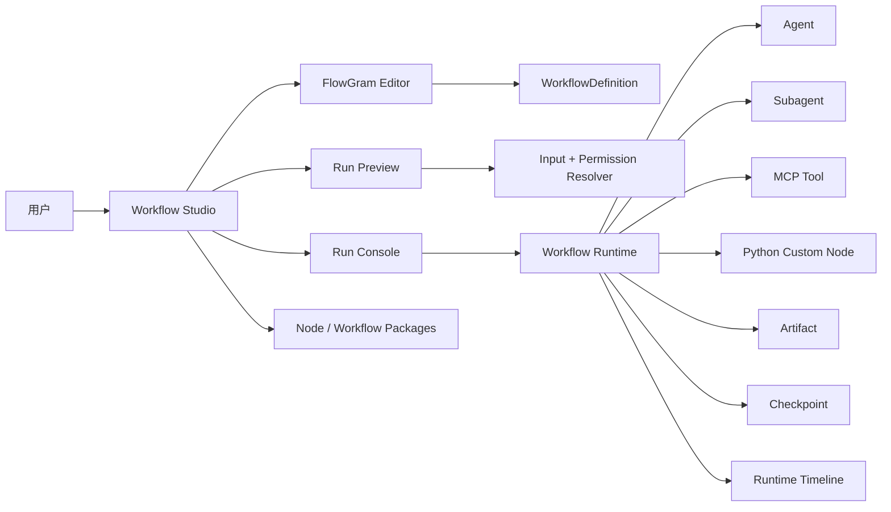

# Workflow Studio 后续开发路线图

更新日期：2026-05-22

适用范围：MTL-Code / Argus 的 Workflow Studio 后续开发。

本文是后续慢慢执行的路线图，不是一次性大改方案。后续每一轮只推进一个清晰切片：先写可失败的测试或源码契约，再实现，再验证，再提交到 `main`。这条路线只聚焦 Workflow Studio，不恢复旧 Swarm，不恢复 Obsidian、内置 CodeGraph、小模型 runtime，不做移动端专项。

## 当前基线

当前 Workflow Studio 已经具备：

- FlowGram 作为主画布，React Flow 已移除。
- `WorkflowStudio` 路由已 lazy load。
- 已抽出 `WorkflowCommandCenter`、`WorkflowHomeView`、`WorkflowLibraryView`、`WorkflowRunConsole`、`WorkflowArtifactGallery`、`WorkflowPermissionPanels`。
- 已有 Simple Mode / Advanced Mode。
- 已有 Library / Editor / Runs 主视图。
- 已有 Run setup、Runtime Visual State、Artifact Gallery、Permission dry-run、Approval、Custom Python Node 的基础闭环。
- 已有截图门禁、workflow quality gate、源码契约测试。

当前主要问题：

- `WorkflowStudio.tsx` 仍有 4000 行左右，Editor 和 Inspector 仍过重。
- Editor 里 Node Palette、Quick Path、Canvas Shell、Inspector、Custom Node Review 混在主组件里。
- 运行能力已有骨架，但用户体验仍不够“顺着做事”。
- preview、run、snapshot、timeline、artifact、permission 的证据链还需要继续闭环。
- 自定义节点生态还缺少生命周期管理、影响分析、升级兼容、测试矩阵。

## 北极星

Workflow Studio 的目标不是“有一个画布”，而是成为 Argus 的生产级 Agent 编排系统：

用户最终应该能做到：

1. 从模板或空白 workflow 开始。
2. 用少量主动作完成添加节点、配置输入、预览、执行。
3. Run 前知道每个节点会拿到什么输入、会触发什么权限、缺什么依赖。
4. Run 中能看懂当前卡在哪里、为什么停、能做什么。
5. Run 后能拿到 artifact、日志、截图证据、风险摘要和可复盘事件。
6. 自定义节点可以由 AI 生成，但必须经过审阅、测试、安装、版本治理。

## 执行原则

- 每轮只做一个切片，不顺手扩展。
- UI 切片优先拆组件，不改变后端语义。
- 行为改动必须先写失败测试。
- UI/执行相关需求必须逐步补 Playwright 截图证据。
- 涉及权限的需求必须能说明 allow / ask / deny。
- 每次稳定切片都提交并推送 `main`。
- 不做移动端专项；桌面是当前唯一主路径。

## 阶段 1：继续拆薄 WorkflowStudio

目标：把 `WorkflowStudio.tsx` 从“所有事情都知道”降到只负责页面编排、数据加载和状态协调。

### 1.1 Editor Node Palette 抽离

范围：

- 抽出 `WorkflowNodePalette`。
- 包含节点搜索、分组、风险标签、添加节点按钮。
- 主组件只传 `paletteGroups`、`filteredNodeTypes`、`riskyNodeTypes` 和 `onAddNode`。

验收：

- `WorkflowStudio.tsx` 不再包含 `data-testid="workflow-node-search"` 和 `data-testid="workflow-add-node"` 的 JSX。
- `WorkflowNodePalette.tsx` 持有这些 UI。
- `WorkflowStudio.test.tsx` 有源码契约。
- `npm run test:unit -- src/components/workflows/view/WorkflowStudio.test.tsx` 通过。

### 1.2 Editor Setup / Guided Builder 抽离

范围：

- 抽出 `WorkflowEditorSetupStrip`。
- 包含 Simple Mode 的 next action、Add step、Generate node、Templates、workflow settings details。
- Advanced Mode 的 guided builder 也迁入同一组件或相邻组件。

验收：

- 主组件不再直接渲染 `workflow-guided-builder`。
- 组件仍保留 `workflow-editor-quick-path`、`workflow-editor-metadata-details`。
- 不改变现有交互。

### 1.3 Editor Canvas Shell 抽离

范围：

- 抽出 `WorkflowEditorCanvasShell`。
- 包含 FlowGram loading boundary、canvas metadata、runtime visual state、selection bridge props。
- 主组件只提供 `draft`、`selectedRun`、`runtimeVisualState` 和回调。

验收：

- FlowGram editor 仍保持 lazy chunk。
- 主组件不承载 canvas shell 的布局 JSX。
- `npm run build` 后仍能看到 `WorkflowFlowGramEditor` 独立 chunk。

### 1.4 Inspector 抽离

范围：

- 抽出 `WorkflowInspectorPanel`。
- 保留 Essential / Advanced progressive disclosure。
- Config / Data / Permissions / Runtime tabs 内部继续逐步拆。

验收：

- 主组件不再直接包含 `workflow-inspector-essential-fields`、`workflow-inspector-advanced-sections`。
- 选中节点、编辑字段、变量提示、权限来源不变。

### 1.5 Custom Node Review 抽离

范围：

- 抽出 `WorkflowCustomNodeReviewPanel`。
- 生成草稿、validate、test、install、stdout/stderr 展示都移出主组件。
- 主组件只保留 draft state 和 API 回调。

验收：

- 主组件不再直接渲染 `workflow-custom-node-*` UI。
- 自定义 Python 节点流程截图门禁不退化。

## 阶段 2：把 UI 路径变顺

目标：让用户第一眼知道下一步做什么，而不是看到一堆工程开关。

### 2.1 Editor 默认路径收敛

范围：

- Simple Mode 默认只露出 Add step、Run、Save、Templates。
- Diagnostics、schema、JSON、contract、benchmark 继续藏在 Advanced / More。
- 清理文案，全部用用户语言，不使用内部技术词当主标签。

验收：

- 首屏能看见“下一步建议”。
- 默认不直接展示 WorkGraph、Migration Doctor、Benchmark 等技术内容。

### 2.2 Runs Story 优先

范围：

- Runs 默认回答三件事：现在在哪、为什么停、用户能做什么。
- logs、events、evidence、attempt compare 放到 Advanced tabs。

验收：

- waiting approval 时 Approval 是主卡片。
- failed 时推荐动作明显。

### 2.3 Library 产品化

范围：

- 模板卡片突出用途、依赖、权限、最近 smoke。
- Preview 侧栏展示输入要求、预期产物、依赖状态。

验收：

- 用户不用进入 Editor，也能判断模板能不能跑。

## 阶段 3：Preview / Run 一致性

目标：Run 前看到的内容和真实 Run 尽量一致，并能解释差异。

工作项：

- 抽出 shared resolver，使 validate-run 和 create-run 使用同一套输入解析逻辑。
- Run 创建时保存 resolver snapshot。
- Runs UI 展示 preview matched / changed。
- 变更节点可以定位到具体字段。

验收：

- 一条 workflow 同时覆盖 matched 和 changed 两种状态。
- 有真实 run 证据和截图。

## 阶段 4：自定义节点生态治理

目标：AI 生成 Python 节点从“能安装”升级到“可治理、可升级、可回滚”。

工作项：

- Node package enabled / disabled / broken / update 状态。
- 禁用、卸载、升级前做 impact report。
- manifest test matrix 执行所有 testCases。
- expectedOutput / expectedStatus 断言。
- schema compatibility 检查。

验收：

- 缺依赖、测试失败、schema 不兼容都不能静默安装或运行。
- UI 有明确风险提示和截图证据。

## 阶段 5：真实执行桥接加深

目标：每类节点都是真执行，不是“看起来 completed”。

优先级：

1. MCP Tool Runtime Bridge
2. Agent / Subagent Terminal Result Bridge
3. Artifact Contract
4. Checkpoint Binding
5. Shell Permission Evidence

验收：

- 每类执行节点都有真实 run id、节点状态、日志或 artifact 证据。
- 下游节点能读取上游输出。
- 失败能归类并给出恢复动作。

## 阶段 6：Runtime Story 与质量门禁

目标：每次打包前知道 Workflow Studio 是否真的可发布。

工作项：

- Workflow benchmark matrix。
- Run evidence export。
- Screenshot evidence viewer。
- Release readiness detail。
- 打包前固定 quality gate。

验收：

- 打包前能看到最近 benchmark、截图、失败原因。
- 关闭 UI/执行/权限需求时必须附证据。

## 近期执行顺序

接下来按这个顺序慢慢做：

1. `WorkflowNodePalette`
2. `WorkflowEditorSetupStrip`
3. `WorkflowEditorCanvasShell`
4. `WorkflowInspectorPanel`
5. `WorkflowCustomNodeReviewPanel`
6. Runs Story UI 收敛
7. Preview / Run resolver snapshot
8. Node package lifecycle
9. MCP runtime bridge
10. Agent/Subagent terminal bridge

## 每轮交付模板

每轮执行都按这个模板收尾：

- 改了什么。
- 哪些文件。
- 验证命令。
- 是否有截图或 run 证据。
- commit hash。
- 是否已推送 `main`。

## 不做事项

- 不恢复旧 Swarm。
- 不恢复 Obsidian、内置 CodeGraph、小模型 runtime。
- 不做移动端专项。
- 不开放 AI 生成 React/TSX UI。
- 不把 FlowGram 内部结构直接变成后端 wire contract。
- 不在一个 PR/提交里混做 UI、runtime、package lifecycle 三类无关改动。
